<h1 align="center">Mega Man Battle Network: Cyberworld Endless</h1>

<p align="center">
<b>A roguelike for Mega Man Battle Network 6.</b><br>
Jack MegaMan into a net that is generated anew every run, and see how deep he gets.
</p>

<p align="center">
<a href="https://saschb2b.github.io/Mega-Man-Battle-Network-Cyberworld-Endless/play/"><b>Play in the browser</b></a>
&nbsp;·&nbsp;
<a href="https://saschb2b.github.io/Mega-Man-Battle-Network-Cyberworld-Endless/">Project page</a>
&nbsp;·&nbsp;
<a href="https://github.com/saschb2b/Mega-Man-Battle-Network-Cyberworld-Endless/releases">Downloads</a>
&nbsp;·&nbsp;
<a href="https://github.com/saschb2b/Mega-Man-Battle-Network-Cyberworld-Endless/discussions">Discussions</a>
&nbsp;·&nbsp;
<a href="https://buymeacoffee.com/qohreuukw">Buy me a coffee</a>
</p>

<p align="center">
<a href="https://github.com/saschb2b/Mega-Man-Battle-Network-Cyberworld-Endless/actions/workflows/ci.yml"></a>


<a href="LICENSE"></a>
</p>

<p align="center">
<a href="https://saschb2b.github.io/Mega-Man-Battle-Network-Cyberworld-Endless/clips/trailer.mp4">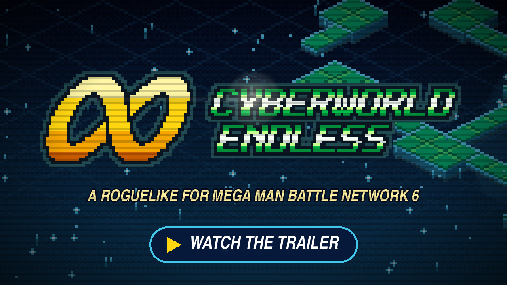</a>
</p>

Everything you see and hear is BN6 itself, running from your own ROM: its
battles, chips, PET, shops and music. Cyberworld Endless builds the net
around it, one layer at a time, and keeps the run going.

- **A new net every run.** Layers of platforms and walkways in the style of
  BN6's areas, with Mystery Data, Net Dealers, Chip Traders and Mr. Progs on
  them, and the game's own viruses in its own random battles.
- **Acts and guardians.** Every third layer ends in a Navi's arena. The act
  card names the guardian, the Net Dealer stocks a chip that answers it, and
  MegaMan warns you how it fights.
- **A run that grows.** A gift to start, Guardian Data (HP, the Navi's chip
  and its Cross), BeastOut from the Graveyard, and rarer chips the deeper
  you go.
- **Deeper, harder, around again.** From the surface areas through the
  story's comps, the Undernet and the Graveyard to the Underground, then
  around again, harder.

<p align="center">
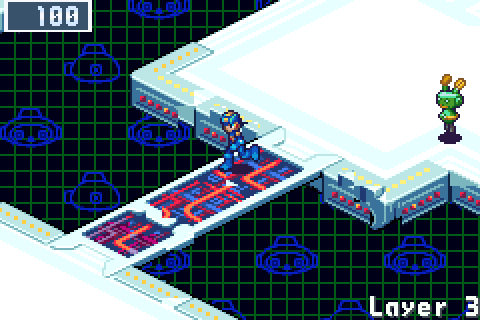
</p>

<p align="center">
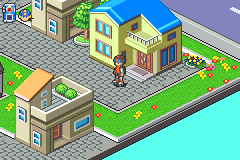
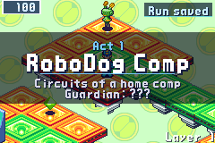
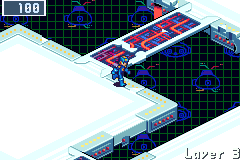
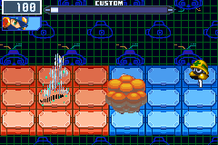
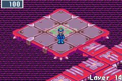
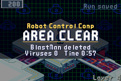
</p>

It runs on handhelds through PortMaster (AmberELEC, ArkOS, Knulli, muOS,
ROCKNIX and more) and was made on the Retroid Nova (4:3) and the Retroid
Pocket Flip 2 (16:9). The same game plays on
Android phones, tablets and handhelds, in a window on a Linux or Windows PC or
a Mac, in a browser at
[saschb2b.github.io](https://saschb2b.github.io/Mega-Man-Battle-Network-Cyberworld-Endless/),
on a phone too, and on a New 3DS from its HOME Menu.

## What you need

- A handheld with PortMaster installed (AmberELEC, ArkOS, Knulli, muOS,
  ROCKNIX and others), a Steam Deck, an
  x86-64 Linux PC (glibc 2.34 or newer: Ubuntu 22.04, Debian 12, Fedora 35
  and later), a 64-bit Windows 10 or 11 PC, a Mac with macOS 11 or newer
  (Apple silicon or Intel), an Android 5 or newer phone, tablet or
  handheld, a New 3DS, New 3DS XL or New 2DS XL with custom firmware
  (Luma3DS) and FBI, or a current browser.
- **Mega Man Battle Network 6: Cybeast Gregar (USA)** as an unmodified `.gba`
  file, dumped from your own cartridge. Its SHA-1 is
  `89fe0bac4fd3d2ab1d2ca35e87ef8b1294a84cd6`. Cybeast Falzar, other regions
  and the Legacy Collection version do not work yet.
- Optional: **Mega Man Battle Network 5: Team Colonel (USA)**, unmodified,
  in the same folder as your BN6 ROM (SHA-1
  `5f472f78d8de2df01d5039e045c043cb40969a39`). Its net areas then turn up
  in runs, in place of the BN6 areas they resemble (ACDC Area, Oran
  Area, SciLab, End Area, its Undernet and Nebula Area), each in about
  half the runs that come there, in BN5's own tiles, music and
  bystanders, their random battles fought in BN5's own engine. A note in
  the title's top right corner says "BN5 found" as the game starts. On
  Linux, macOS, Windows, the Steam Deck, PortMaster handhelds, Android,
  iPhones and iPads (there, choose the folder that holds both ROMs, or
  put BN5 in it later) and in the browser (choose it on the player's page
  beside BN6, or add it later); not on the 3DS.

No download and no page contains Capcom data. Without the ROM there is no
game.

## Install

Every system has its own download on the [releases page](https://github.com/saschb2b/Mega-Man-Battle-Network-Cyberworld-Endless/releases): pick
yours from the table. The project's
[download page](https://saschb2b.github.io/Mega-Man-Battle-Network-Cyberworld-Endless/download/)
leads with the system you visit it with, and lists every other. Each needs your own
ROM ([What you need](#what-you-need)); none contains game data.

| You play on | Download | Steps |
| --- | --- | --- |
| Windows 10 or 11, 64-bit | `cyberworld-endless-windows-x64-setup.exe` (an installer) or `cyberworld-endless-windows-x64.zip` (a folder, nothing installed) | [On Windows](#on-windows) |
| A Mac, macOS 11 or newer | `cyberworld-endless-macos.dmg` | [On a Mac](#on-a-mac) |
| A Linux PC, x86-64 | `cyberworld-endless-x86_64.AppImage`, `cyberworld-endless.flatpak`, `cyberworld-endless_amd64.deb` or `cyberworld-endless-linux-x86_64.tar.gz` | [On a Linux PC](#on-a-linux-pc) |
| A Steam Deck | `cyberworld-endless.flatpak` | [On a Steam Deck](#on-a-steam-deck) |
| An Android phone, tablet or handheld | `cyberworld-endless.apk` | [On Android](#on-android) |
| An iPhone or iPad, iOS 14 or newer | through SideStore or AltStore Classic: its source, `altstore-source.json`; or `cyberworld-endless.ipa` | [On an iPhone or iPad](#on-an-iphone-or-ipad) |
| A handheld with PortMaster | `cyberworld-endless-portmaster.zip` | [On a PortMaster handheld](#on-a-portmaster-handheld) |
| A New 3DS, New 3DS XL or New 2DS XL | `cyberworld-endless.cia` (HOME Menu) or `cyberworld-endless.3dsx` (Homebrew Launcher) | [On a New 3DS](#on-a-new-3ds) |
| A browser, a phone's too | nothing: [the player](https://saschb2b.github.io/Mega-Man-Battle-Network-Cyberworld-Endless/play/) | [In a browser](#in-a-browser) |

Releases up to 0.6.0 named the PortMaster port
`cyberworld-endless-rocknix-portmaster.zip`; up to 0.4.0 it was
`cyberworld.zip`, the Windows installer `cyberworld-endless-setup-x64.exe`
and the website's files `cyberworld-endless-web.zip`.

### On Windows

From the [releases](https://github.com/saschb2b/Mega-Man-Battle-Network-Cyberworld-Endless/releases), for 64-bit Windows 10 and 11:

- **Installer:** `cyberworld-endless-windows-x64-setup.exe` installs the game for
  you alone (no administrator), adds it to the Start menu and, if you like,
  the desktop; Settings > Apps removes it again.
- **Zip:** `cyberworld-endless-windows-x64.zip` holds the same game in a
  folder: unpack it anywhere and run `cyberworld-endless.exe`.

The game is not signed, so Windows may say "Windows protected your PC" the
first time: **More info**, then **Run anyway**. The first start looks for
the ROM in Downloads and asks for the file if it is not there; it keeps a
copy in `%LOCALAPPDATA%\cyberworld-endless\rom\`, where the saves live
too (uninstalling leaves them). It opens in a window at the largest whole
scale that fits; F11 or Alt+Enter switches to fullscreen. Keyboards and
controllers (Xbox, PlayStation, Switch) work as on Linux. Steam's own **Add
a Non-Steam Game** takes `cyberworld-endless.exe`.

### On a Mac

`cyberworld-endless-macos.dmg` from the [releases](https://github.com/saschb2b/Mega-Man-Battle-Network-Cyberworld-Endless/releases) holds one app for Apple
silicon and Intel Macs, macOS 11 and newer: drag **Cyberworld Endless** into
Applications. Apple has not notarized it (that takes a paid developer
account), so the first start is refused: open **System Settings > Privacy &
Security**, choose **Open Anyway** beside Cyberworld Endless and confirm (on
macOS 14 and older, Control-click the app and choose **Open**). The first
start looks for the ROM in Downloads and asks for the file if it is not
there; the ROM's copy, the saves and `keys.ini` live in
`~/Library/Application Support/cyberworld-endless/`.

### On a Linux PC

Three ways from the [releases](https://github.com/saschb2b/Mega-Man-Battle-Network-Cyberworld-Endless/releases), each with a menu entry and an icon you
can pin to the dock:

- **AppImage** (any distribution): download
  `cyberworld-endless-x86_64.AppImage`, make it executable (`chmod +x`, or
  the file's Properties) and start it. On the first start it offers to add
  itself to the application menu. It does not need libfuse2.
- **.deb** (Debian, Ubuntu, Mint, Pop!_OS): download
  `cyberworld-endless_amd64.deb` and open it with your software centre, or
  `sudo apt install ./cyberworld-endless_amd64.deb`. It appears in the menu
  as **Cyberworld Endless**; remove it like any other package.
- **Flatpak** (any distribution with Flatpak): download
  `cyberworld-endless.flatpak` and open it with your software centre, or
  `flatpak install --user cyberworld-endless.flatpak`.

On the first start without a ROM it looks in Downloads and in EmuDeck's and
RetroDECK's folders, then asks for the file (a file chooser when `zenity`
or `kdialog` is installed), and keeps a copy in
`~/.local/share/cyberworld-endless/rom/` (the Flatpak's in
`~/.var/app/io.github.saschb2b.Mega-Man-Battle-Network-Cyberworld-Endless/data/`), where your saves
also live. It opens in a window at the largest whole scale that fits; F11
or Alt+Enter switches to fullscreen.

With Steam installed, the first start from the desktop offers to add the
game to Steam as well, with its library artwork; `--add-to-steam` does it
later (the AppImage: `./cyberworld-endless-x86_64.AppImage --add-to-steam`;
the Flatpak: see the Steam Deck steps below).

`cyberworld-endless-linux-x86_64.tar.gz` is the same game as a plain folder:
unpack it anywhere and run `./cyberworld-endless`; `./install.sh` adds it
to the menu. Its `README.md` has the keyboard keys.

### On a Steam Deck

The Deck runs the Linux build, best as a Flatpak, the way SteamOS installs
software:

1. In Desktop Mode, download `cyberworld-endless.flatpak` from the
   [releases](https://github.com/saschb2b/Mega-Man-Battle-Network-Cyberworld-Endless/releases)
   and open it: Discover installs it (and the runtime it needs from
   Flathub).
2. Add it to Steam with its library artwork (the capsules, the banner, the
   logo and the icon): open **Konsole** and paste

   ```bash
   python3 "$(flatpak info --show-location io.github.saschb2b.Mega-Man-Battle-Network-Cyberworld-Endless)/files/share/cyberworld-endless/steam/add-to-steam.py"
   ```

   It asks to close Steam for a moment (Steam reads its games only when it
   starts), adds the game and opens Steam again; run it again after
   reinstalling, add `--remove` to take the entry away. Without the
   artwork: right-click **Cyberworld Endless** in the application menu and
   choose **Add to Steam**.
3. Return to Gaming Mode: the game is in your library under **Non-Steam**,
   and Steam hands the Deck's controls to it as a gamepad.
4. The ROM: with EmuDeck or RetroDECK there is nothing to do. The game looks
   in `Emulation/roms/gba` and `retrodeck/roms/gba`, on the Deck and on its
   SD card, finds the ROM by its contents and keeps a copy of its own.
   Otherwise put the `.gba` file (unzipped) into Downloads, or choose it on
   the first start in Desktop Mode.

The AppImage works too: right-click it, **Properties**, **Permissions**,
**Is executable**, and start it once in Desktop Mode. It offers to add
itself to the application menu and to Steam, with the artwork.

In Gaming Mode it fills the screen, at 5x (1200x800) on the Deck's 1280x800.
On a Deck OLED, set the game's refresh rate to 60 Hz (the **...** button,
**Performance**, **Refresh Rate**, with the per-game profile on): the game
runs at the GBA's 60 frames a second, which the OLED's 90 Hz shows for one
refresh or two in turn, a slight judder. Or keep 90 Hz and turn on
smooth motion ([Screen](#screen)).
The Deck's A, B, L1 and R1 are the GBA's A, B, L and R, the Menu button (☰)
is Start and the View button (⧉) is Select. To quit, hold View and Menu
for a second, then again; or use the Steam button's **Exit Game**. Saves
live in `~/.var/app/io.github.saschb2b.Mega-Man-Battle-Network-Cyberworld-Endless/data/cyberworld-endless/`
(the AppImage's in `~/.local/share/cyberworld-endless/`) and survive
SteamOS updates.

### On Android

Download `cyberworld-endless.apk` from the
[releases](https://github.com/saschb2b/Mega-Man-Battle-Network-Cyberworld-Endless/releases)
on the phone, tablet or handheld and open it (Android asks once to allow
installs from your browser or file manager). The first start asks for the
folder your ROMs are in, with Android's own folder picker: the app opens
only the `.gba` files there and keeps copies of BN6's and, if it is there,
BN5's in its own storage, beside your saves. It names any `.gba` it refuses,
and why ("BN6 Cybeast Falzar, not Gregar"). Android 11 and later keep apps
out of Download itself: put the ROMs in a folder in it, such as
Download/ROMs, or tap **Choose the files instead** and pick BN6 and BN5
together (hold one to select both). The folder is looked in again at each
start, so BN5 put there later comes in by itself; after choosing the
files, hold the app's icon and tap **ROMs** (Android 7.1 and later) to add
BN5. A handheld's own controls, a Bluetooth or USB
controller (two Joy-Cons as one) and the touch screen all work: the game
draws touch controls round the picture until a controller's button is
pressed, and Back asks before it quits. On a handheld with a second
screen, such as the AYN Thor, the lower one keeps the layer's map open, as
on a 3DS ([android/README.md](android/README.md#the-second-screen)).
Uninstalling the app deletes its saves.

### On an iPhone or iPad

Apple's App Store has no place for a game that runs on a ROM, so the app
comes through [SideStore](https://sidestore.io), which installs apps with
your own Apple ID and keeps them up to date. Not AltStore PAL, the EU's App
Marketplace edition: it installs only apps Apple has notarized ("missing a
marketplaceID").

1. Set up SideStore once, with a computer: [iloader](https://iloader.app)
   (Windows, macOS or Linux) installs it over a USB cable, then the
   LocalDevVPN app on the phone lets SideStore install and renew apps by
   itself ([SideStore's guide](https://docs.sidestore.io/docs/installation/install)).
   On iOS 16 and newer, turn on Developer Mode too. AltStore Classic works
   the same way, with AltServer on a Windows PC or a Mac.
2. In SideStore, open **Sources**, tap **+** and add
   `https://github.com/saschb2b/Mega-Man-Battle-Network-Cyberworld-Endless/releases/latest/download/altstore-source.json`
   (the [download page](https://saschb2b.github.io/Mega-Man-Battle-Network-Cyberworld-Endless/download/#ios)
   has a button that does it on the phone).
3. Install **Cyberworld Endless** from the source. With a free Apple ID an
   app lasts seven days: SideStore renews it, and offers each new version.
4. Start it and tap **CHOOSE FOLDER**: pick the folder your ROMs are in,
   in Files. The app opens only the `.gba` files there, copies BN6's and,
   if it is there, BN5's in, and looks in the folder again at each start,
   so BN5 put there later comes in by itself. A file in iCloud Drive that
   is not on the phone yet is downloaded first (in a big folder, download
   BN6's in Files yourself). Or tap **CHOOSE FILES** and pick the ROMs, or
   put them in Files, **On My iPhone › Cyberworld**, where the app keeps
   your saves too and looks at every start.

Touch controls round the picture, or a controller (MFi, Xbox,
PlayStation). `cyberworld-endless.ipa` on the releases page is the app
alone, for another installer. The app was built and started in the iOS
Simulator, not yet on an iPhone: reports are welcome.
[ios/README.md](ios/README.md) has the rest.

### On a PortMaster handheld

For a handheld whose firmware runs PortMaster: AmberELEC, ArkOS, Knulli,
muOS, ROCKNIX and others (the game was made on a Retroid Nova and a
Retroid Pocket Flip 2). On a PC, a Mac or an
Android device, take that system's download from the table above.

1. Download `cyberworld-endless-portmaster.zip` from the
   [releases](https://github.com/saschb2b/Mega-Man-Battle-Network-Cyberworld-Endless/releases) and unpack it (or build it with
   `python3 build.py package`, which writes it to `build/release/`, see
   [Building](#building)).
2. Copy `cyberworld/` and `Cyberworld Endless.sh` into the handheld's
   `ports` folder, where PortMaster keeps its ports (on ROCKNIX:
   `/storage/roms/ports/`).
3. Copy your ROM into `ports/cyberworld/rom/`. The file name does not matter;
   the game checks the contents.
4. Refresh the game list and start **Cyberworld Endless**.

The first start records the game's boot once, which takes a few seconds.
After that the game starts straight away.

### On a New 3DS

On a New 3DS, New 3DS XL or New 2DS XL with custom firmware (Luma3DS),
open **FBI**, choose **Remote Install**, then **Scan QR Code**, and scan the
code on the
[download page's 3DS entry](https://saschb2b.github.io/Mega-Man-Battle-Network-Cyberworld-Endless/download/#3ds):
FBI downloads `cyberworld-endless.cia` from the newest release and installs
it on the HOME Menu, with its icon and banner. Or copy the CIA to the SD
card and install it from FBI's SD browser. `cyberworld-endless.3dsx` is the
same game for the Homebrew Launcher (`sdmc:/3ds/`).

Put your ROM in `sdmc:/3ds/cyberworld-endless/rom/`, or leave it where you
keep GBA games (`sdmc:/roms/gba/`, `sdmc:/roms/`, `sdmc:/gba/`): any file
name works. The first NEW GAME boots BN6 once, about 15 seconds of black
screen. The bottom screen is the PET beside the game, framed like BN6's
own PET screens, with HP, Zenny and BugFrags; on the net it shows the
layer's map, always open, in the folder editor the whole folder, in a
battle the Custom screen's chip and the fight, in the NaviCustomizer the
program under the cursor and what RUN would bring, in a shop the entry
under the cursor, and in the town and on the title the PET at home with
MegaMan's face.
The older 3DS and 2DS are too slow for it.
[3ds/README.md](3ds/README.md) has the rest.

### In a browser

Open **[the player](https://saschb2b.github.io/Mega-Man-Battle-Network-Cyberworld-Endless/play/)** and choose your ROM file, or drop it on
the page; Battle Network 5: Team Colonel's beside it if you have it (both
at once, or BN5 later with **Add BN5 Team Colonel**). The page checks each
file by its SHA-1, says why it refuses one, and keeps them, with your
saves, in the browser's own storage (IndexedDB); they are never uploaded.
Next time **Jack in** starts straight away. **Forget ROMs and saves**
removes them all. BN5's battles run on a second emulator core in the
page: the first time, BN5 starts up while the title shows (about 20
seconds on a recent laptop, a slice of each frame), and a battle in its
areas that comes before it is done waits behind a short note, once per
browser.

On a phone or tablet the game fills the screen and draws its own buttons
round the picture, sized for a thumb: a D-pad, A, B, L, R, Start and
Select, under the picture when the phone is upright and beside it when it
lies on its side, and a MENU button that sizes and moves them (see
[Playing](#playing)). A controller or a keyboard puts them away until the
screen is touched again.
Added to the home screen (the browser's *Add to Home screen* or *Install*),
it opens full screen like an app.

`cyberworld-endless-website.zip` on the releases page is this site and its
player as files, for hosting them yourself; playing needs none of it.

## Playing

Each start opens with the developer's boot screen and a note from MegaMan
on where to report bugs and ideas: the project's GitHub page, with a QR
code for a phone's camera. Any button skips them.

On the title screen, press Start and choose **NEW GAME** or **CONTINUE**.
CONTINUE shows how deep your saved run is; the corner shows your best depth.

In the net, the buttons are the Game Boy Advance's and BN6 plays as it always
has. On a keyboard the layout is the one Capcom's PC version (the Legacy
Collection) uses: the left hand moves and opens the Custom screen, the right
hand uses chips and the buster.

| Button | Keyboard | Also |
| --- | --- | --- |
| D-Pad | W A S D | Arrow keys |
| A | J | X |
| B | K | Z |
| L / R | Q / E | |
| Start | Enter | Keypad Enter |
| Select | R | Backspace |

Keys are positions, so on an AZERTY keyboard you move with Z Q S D. F11 or
Alt+Enter switches to fullscreen; Escape twice quits. A controller's D-pad
and left stick move, its A and B are A and B (on a Nintendo pad the buttons
marked so), its shoulders and triggers L and R, Start is Start and Back
(Minus) is Select; holding Back and Start for a second, twice, quits,
whatever they are set to. Two Joy-Cons are one controller, on a phone too;
one alone is a small one held sideways.

**The controls screen** sets the buttons. **Select** on the title screen
opens it (the line under the menu names the button it is on); on a phone
or tablet with a controller, so does **CONTROLLER** in the touch controls'
menu, mid-run too. **A and B** has presets: as labeled; **B on X**, left of
A as on the GBA (Square on a PlayStation pad; a Nintendo pad has its B
there already); and A and B swapped, for a pad that reads them the other
way round. Choose A, B, L, R, Start or Select and press the button (or, on
a PC or in a browser, the key) you want for it; one that this leaves with
no button takes the old one in exchange. **Defaults** brings them all back, and
**Done** asks you to press the new
A to keep them: if you do not within ten seconds, the old ones stay. The
screen itself always takes the controller's own A, B and D-pad, the
keyboard and taps, whatever the buttons are set to. Nintendo's pads keep
their buttons apart from the others', as their A sits where the others'
B does. The screen writes `pad.ini` and `keys.ini` in the save folder
(`~/.local/share/cyberworld-endless/` on Linux, `savedata/` on the
handheld), made with these defaults on the first start; by hand they set
the D-pad and the sticks too (`pad.ini` names a controller's buttons as
SDL does: `a`, `leftshoulder`, `lefttrigger`, `-lefty`).

A touch screen shows the buttons on it from its first touch (a Steam
Deck's too), until a key or a controller is used again. The D-pad takes
diagonals where MegaMan walks (the net's walkways run along them) and four
directions in battles and menus. Their **MENU** button pauses the game and
opens their menu: **SIZE** and **OPACITY** of them all, **HAPTICS** (a tick
under the thumb, on Android and in browsers that can), **CONTROLLER** (the
controls screen, where a controller is connected) and **EDIT LAYOUT**: tap
a button to choose it, drag it where your thumb wants it, pinch it or drag
a corner to size it, give it its own opacity, or take a preset
(**DEFAULT**, **LEFT-HANDED**, **COMPACT**, and **LARGE** where the screen
has room); **DONE** keeps them, **CANCEL** leaves them as they were. The
phone upright and on its side keep an arrangement each (`touch.ini` in the
save folder).

| Button | In the net | In battle |
| --- | --- | --- |
| A | Talk, open Mystery Data | Use a chip |
| B | Run; in a chat, hold to fast-forward the text | Fire the buster |
| L | Ask MegaMan where you are and what's ahead; the layer's Mystery Data counters show at the top right for a few seconds | Open the Custom screen; on it, try to run (never from a guardian) |
| R | Jack in (at the town's statue) | Open the Custom screen; on it, describe the chip or Cross under the cursor |
| Start | Open the PET | Pause |
| Select | Hold for the map of the layer so far: where you have been, the services (those MegaMan senses but you have not reached as rings where they stand, or arrowheads on the frame pointing their way), the way to the exit or guardian, and the Mystery Data MegaMan knows of by colour: taken, of those seen or sensed behind a set piece (dim once all are taken; there may be more out there), each one seen and not yet taken marked where it stands (and, while you hold an Unlocker, every purple one); let go, and the arrow shows the way on | On the Custom screen, hide it to see the field; again to bring it back |

In the net MegaMan walks as in BN6: a single direction goes straight across
the screen, and two together (like DOWN+LEFT) go along a walkway. A turns
him to the navi or Mystery Data beside him, or walks him up to one a step
or two before him.

### A run

A new stretch of net has opened under the town: the Endless Net. Its
paths change every time someone jacks in, it only goes down, and
everything in it is copied from the real net, the guardians too, built
from every battle MegaMan has fought. Something at the bottom keeps
copying. Dad calls the first time; after that Lan and MegaMan talk it
over as they go, and L asks MegaMan where they are.

A run begins in town: Central Town or ACDC Town, Capcom's own, set out a
little differently each run, or Seaside Town or Green Town as they
stand, with shops, houses, townsfolk to talk to and signs to read. Walk
to the town's landmark (the blue bird on Central Town's plaza, the
squirrel in ACDC Town's park, the mermaid fountain by Seaside's whale,
the knight on Green Town's flower plaza) and press R: Lan jacks MegaMan
in, and the net begins.

<p align="center">
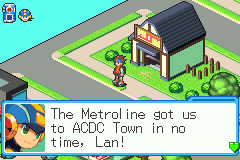
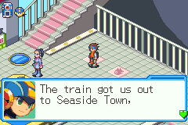
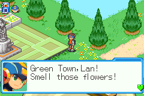
</p>

<p align="center">
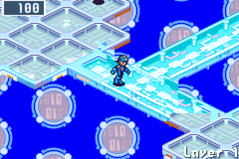
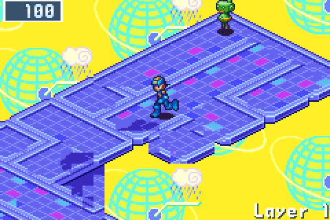
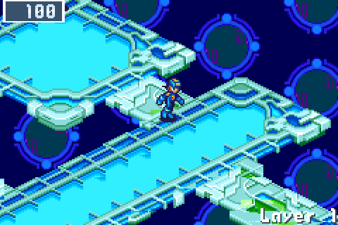
</p>

Each layer is a new layout of platforms and walkways in the style of one of
the game's areas. Find the exit pad to go one layer deeper. On the way, the
game's own random battles come up, with the viruses of that area. How hard
a battle is depends on how deep you are, not on the area: the viruses grow
stronger (V2, V3, SP) act by act, and a battle never holds more than MegaMan
can be expected to handle at that point. The first battles of a run, and
the first after each guardian, are gentler. Rewards follow the Busting
Level as in BN6. The battlefields are the area's own too: its panels
(grass, ice, holes), and where BN6 set them, rocks and cubes. Now and then
(a battle in forty or so) a green Mystery Data sits on the enemies' side:
it breaks at the first hit, yours or theirs, but still there when the
battle ends, it gives a rare find besides the battle's reward: most often
a chip a tier above a blue Mystery Data's, in your folder's codes.

Three layers make an act. The second layer of every act always has the Net
Dealer and a Recovery Mr. Prog. The third ends in a guardian's arena, and
the room before it again has a heal and the Net Dealer. The card at the
start of each act shows the guardian waiting at its end, so you can set
your folder for it, once MegaMan knows him. A guardian he has never
battled is "???", a strong signal he doesn't recognize, until the Navis
on the net talk: a bystander on the act's first layer has heard who it
is, and every Net Dealer keeps two of a chip that answers the act (the
guardian's weakness, or a hard hitter when it has none) and says so.
Step into the arena and the Navi logs in for the game's own boss
battle. Once MegaMan has battled a guardian, in any run, he knows it:
the card names it, and on its layer he warns you of its way of
fighting from his battle data. Guardians remember how your earlier
battles went. Their Guardian Data ends with the way on: two areas for
the next act, each named with its guardian and his element where
MegaMan knows him, so you choose the fight your folder answers.
In the short net, once the Secret Area has been cleared in any run, act
2's also offers a dark way: act 3 in the Undernet, with one of its own
Navis, harder battles and richer data.

A run is **the short net**: three acts, then the Cybeast Nest on layer 10,
about an hour. When the Nest's guardian falls, the run is won, and that
opens **the endless net**: the long dive described below, repeating
harder after its own Nest.

The endless net's first four acts visit four of Central, Seaside, Sky and Green Area, the
Robot Control, Aquarium, Judge Tree, Mr. Weather and CopyBot comps, two home
computers and the Aquarium, ACDC, Green and Sky homepages. The order is
random, but the gentler areas come first (Central or a home computer) and
the hardest last (Sky, Mr. Weather,
ACDC HP, CopyBot's comp). Then come the Undernet and the Graveyard, and
layer 19 is the Underground. After that the cycle starts again, harder.

### Getting stronger

- **A gift to start.** On the first layer a Mr. Prog lets you pick one: two
  HPMemory, a ★3 chip or a NaviCust program. If your last run ended before
  its first guardian, he adds an HPMemory.
- **Guardian Data.** Every guardian leaves five HPMemory (+100 max HP), its
  own Navi chip at the version you beat (in `*` where BN6 has one and your
  folder doesn't use its letter), and its Cross where it has one.
  Taking it also restores MegaMan's HP.
- **The NaviCust.** Guardian Data also offers three NaviCust programs, one
  from each of three builds (buster, hand, guard, field, HP), or BugFrags
  if you take none. The second and fourth acts' guardians grow the board
  from 4x4 to 5x4, then 5x5. A layout that breaks BN6's rules runs bugged,
  and MegaMan says what the bug does. A program turns with L and R only
  with its colour's Spin: each run hides one, a colour you don't have yet,
  in a blue Mystery Data deeper in, and you keep it for every run after.
  A program's compression code, once you enter it (hold RIGHT on the
  program in the NaviCust and press its ten buttons), is kept for every run
  after: Dad's Compression mail lists it, and MegaMan names it when the
  program would only fit compressed.
- **Reg memory.** Each layer before a guardian hides a RegUp, behind a
  lock or at a detour's end: Reg memory grows from 4 MB to about 20 by the
  third act, and a Regular Chip that fits (the folder's EDIT, SELECT)
  starts every battle in your hand. Winning a duel against ProtoMan earns
  Chaud's TagChip system for good: two chips tagged come to your hand
  together.
- **Crosses.** Deleting HeatMan, ElecMan, SlashMan, EraseMan or ChargeMan
  gives MegaMan their Cross for the rest of the run, chosen in the Custom
  screen as in BN6.
- **BeastOut.** The Graveyard's guardian wakes the Cybeast, and BeastOut
  joins the Custom screen.
- **Chips.** Mystery Data, shops and traders draw from the whole chip
  library by rarity: Megas deeper down and, rarely, a Giga. Green Mystery
  Data holds chips, zenny and BugFrags; in deep layers a blue one may hold
  ScrtData.

### Places to find

| Place | What it does |
| --- | --- |
| Net Dealer (a green Normal Navi) | The game's shop: chips, an HP Memory and SubChips |
| NaviCust vendor (a pink navi) | NaviCust programs from the game's own shops |
| Chip Trader | Three chips in, one out |
| BugFrag Trader | The game's BugFrag trades |
| Recovery Mr. Prog | Restores HP |
| Server | A strong virus signal: an optional harder battle that pays a better chip. From the fourth act it may hold an SP Navi. Never on the first layer |
| Dark flame | Enters the Undernet: tougher viruses, and an exit one layer deeper |
| Golden gate | Three ScrtData open the Secret Area in Undernet Zero |
| Sealed gate | From the third act: sealed with a Navi's code, which deleting him twice as a guardian earns, in any runs. Once earned, every such gate opens to his SP, whose chip is the prize |
| Collector's vault | From the second act: its lock opens for a Library of 30 chips (60 in act 3, 90 later), and it holds three rare chips, one to take |

### What carries over

MegaMan starts every run as strong as the first time: what runs leave
behind is options. From the second run, NEW GAME opens a setup:

- **Net:** the short net, or the endless net once a short one is won.
- **Folder:** BN6's starting folder, or one opened in any run: Blade
  (swords in S for LifeSword), once any guardian falls, and Storm (Elec
  chips), once an Aqua guardian does. Chips the net gives lean to the
  codes the folder holds most.
- **Cross:** a Cross MegaMan has from the first battle, once its Navi
  (HeatMan, ElecMan, SlashMan, EraseMan, ChargeMan) has fallen as a
  guardian. It is the run's only Cross: guardians' Cross data won't fit
  beside it.
- **Threat:** ten rungs that each add one constraint (stronger viruses
  from act 2, fewer heals, dearer dealers, EX guardians, SP Navis in
  Servers, Mystery Data of chips only, half the Chip Traders, drafts of two
  programs, four HPMemory a guardian, a second guardian below the short
  net's Nest), each opened by winning on the one below.
- **Help:** two more HPMemory at the start, a heal on every layer, gentler
  battles, and All *: every chip of the run in *, the wildcard, so any five
  go in a hand and every Program Advance forms from its chips in order.
  Helped runs count for everything.

Every chip MegaMan holds joins the Library, BN6's own, which every run's
PET shows whole: a Chip Trader's prize is new to it first, and the summary
counts what a run added. The NaviCust programs MegaMan has run with come
back too: a later run's program vendor lists two of them first, and the
Spins found, one a run, turn their colour's programs in every run after. The run's
summary names what it opened, the closest goal and the helpers it had. Milestones put BN6's
own marks on the title: Gregar's head for a won short net, Bass for the
endless net's Nest, the S for the Secret Area, the green disc for a win on
the top threat rung, STD, MEGA and GIGA COMP for a class of the Library
complete.

### Saving and losing

The run is saved each time you arrive on a layer and as a guardian's
Guardian Data appears ("Run saved" shows in the corner), and again when
you quit while MegaMan is free to move on a layer (not in a battle, a
talk or a guardian's scene; the quit prompt says which); CONTINUE brings
you back to where it was saved. The PET's Save saves the run where
MegaMan stands; its E-Mail keeps Dad's mails: the dive's report, your
records against every guardian, and the battle data on each one you have
met. When MegaMan is
deleted the run is over: the title screen shows how deep you got, how many
viruses and Navis you deleted, and your best depth. When the short net's
Nest falls, the run is won.

Saves live in `ports/cyberworld/savedata/`. To give up a run without playing
it out, delete `savedata/run.sav`; your best depth is kept in `profile.sav`.

## Screen

The game's 240x160 picture is scaled by a whole number so it stays sharp: 5x
on the Nova's 1280x960 screen and 6x on the Flip 2's 1920x1080 screen, with
black borders around it. Where a whole number would leave it a quarter
smaller or more than the screen allows, it fills the screen instead, each
pixel's edge a little soft: on a 640x480 screen (an RG35XX Pro, an RG35XX
Plus) it is 640x427 rather than 480x320. `screen = whole` in `settings.ini`
in the data folder keeps whole pixels everywhere, `screen = fill` fills
every screen, and `screen = auto` is the default. On a PC the window keeps
the same rules as it is resized. A phone held upright shows the picture as
wide as its screen the same way, over the touch controls (1080x720 on a
1080-wide phone, rather than 960x640), wherever the controls keep their
size; on its side the picture keeps its whole scale beside them.

The game runs at the GBA's 60 frames a second. A 60 or 120 Hz screen shows
every frame for the same time; a 90, 144 or 165 Hz one (a Steam Deck OLED,
many PC monitors) shows them for one refresh or two in turn, which reads as
a slight judder. **Smooth motion** mixes the two latest frames at each
refresh instead: motion is even, a little blurred, and a frame later. Turn
it on with `smooth_motion = on` in `settings.ini` in the data folder (made
on the first start), or with the **Smooth motion** button under the
browser player. A screen at 60 or 120 Hz, or one that follows the game
(FreeSync, G-Sync), needs neither.

## Troubleshooting

- **"Put your Mega Man Battle Network 6: Cybeast Gregar (USA) ROM in ..."**:
  the game found no ROM. Check that the `.gba` file is in
  `ports/cyberworld/rom/`.
- **"... is not a supported ROM"** or **"... is not an 8 MB GBA ROM"**: the
  file is a different game, version or region, or it is patched or
  compressed. Only the unmodified US Cybeast Gregar works.
- **Anything else**: the last start's output is in `ports/cyberworld/log.txt`.
  Please attach it when you report a problem.

## Building

For developers. Builds run in Docker:

```bash
python3 build.py
```

```bash
python3 build.py test
```

```bash
python3 build.py package
```

```bash
python3 build.py run
```

`run` builds the Linux desktop binary and plays it on this machine in a
window, with the ROM from `~/.cache/mmbn-ref/roms` (or `CYBERWORLD_ROM_DIR`)
and saves in `.build/desktop`. `python3 build.py serve` builds the project
site and the browser version and serves them on `http://localhost:8080`;
`python3 build.py screenshots` retakes the screenshots in
`docs/screenshots` from scripted headless runs, and `python3 build.py clips`
records the site's short videos (WebM and MP4, `docs/clips`, and a GIF of
the guardian for this README) the same way. `python3 build.py release`
writes the release files to `build/release/`, each named for its system:
`cyberworld-endless-portmaster.zip` for PortMaster; for Linux the
AppImage (with its `.zsync` for updates), the `.deb` and the tar.gz; and
`cyberworld-endless-website.zip`, the site and the player to host
elsewhere. Each target builds in its own Docker image
(`docker/`): the handheld on Debian bullseye, whose glibc is older than
any firmware PortMaster serves, with the firmware's own SDL2; the Linux desktop on
bookworm with SDL2 built to load X11, Wayland and the sound servers at run
time, the browser with Emscripten.

GitHub Actions (`.github/workflows/`) builds every target on each push and
pull request, runs the ROM-free tests under the sanitizers and lints the
scripts. A push to `main` publishes the browser build on GitHub Pages; a
tag such as `v1.0.0` publishes a release with all three archives.

`build.py shot` runs the game headlessly for scripted screenshots and soak
tests, `build.py atlas` draws every area's layers and `build.py tour` has the
game show every room of them. In the game, Select+R opens a dev menu (no
random battles, can't die, one-hit enemies, speed, skip to the next layer or
guardian). See [docs/DEVTOOLS.md](docs/DEVTOOLS.md) for the tools,
[AGENTS.md](AGENTS.md) for the development workflow,
[docs/LEVEL_DESIGN.md](docs/LEVEL_DESIGN.md) for how layers are laid out and
[docs/ROM_DATA.md](docs/ROM_DATA.md) for where the ROM data comes from.

## Follow updates

- **On GitHub:** on this repository, **Watch → Custom → Releases**, and
  GitHub tells you when a new version is out.
- **Without an account:** add the [release feed](https://github.com/saschb2b/Mega-Man-Battle-Network-Cyberworld-Endless/releases.atom) to any
  RSS reader.
- **Talk:** the [Discussions](https://github.com/saschb2b/Mega-Man-Battle-Network-Cyberworld-Endless/discussions) have the announcements,
  questions and answers, ideas and players' runs.

## Support

Cyberworld Endless is free, and stays free. If you enjoy it and want to say
thanks, you can [buy me a coffee](https://buymeacoffee.com/qohreuukw). Bug reports and playtest notes in
the [issues](https://github.com/saschb2b/Mega-Man-Battle-Network-Cyberworld-Endless/issues)
help just as much.

## Credits

Mega Man Battle Network is © Capcom. This project is not affiliated with or
endorsed by Capcom. The code is MIT-licensed. The
[bn6f disassembly](https://github.com/dism-exe/bn6f) was an invaluable map of
the game's data; none of its files are included here. The game's own code
runs on an embedded [mGBA](https://github.com/mgba-emu/mgba) core (0.10.5,
MPL-2.0; its license ships in `licenses/`). The chime at the start is
[UI Success Chime](https://pixabay.com/sound-effects/ui-success-chime-513565/)
by SoundShelfStudio, from Pixabay (the Pixabay Content License).
