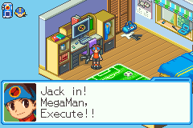
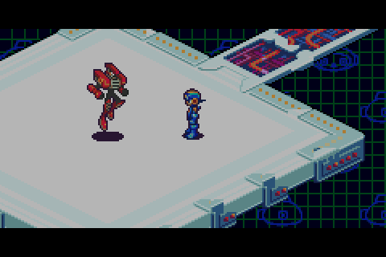
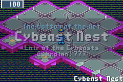
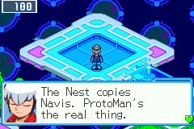
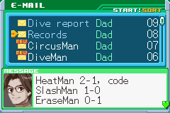
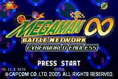
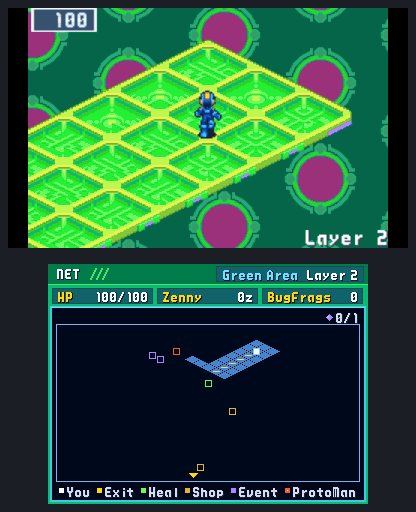
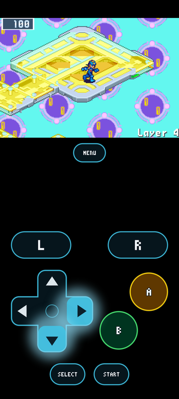
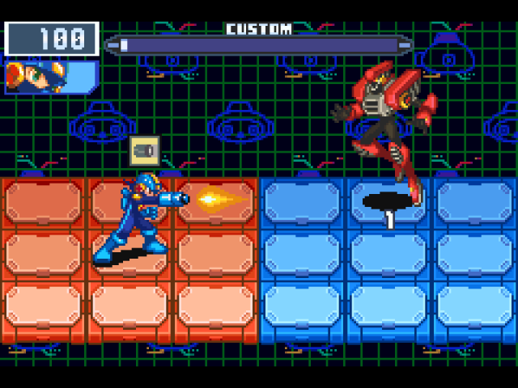

<h1 align="center">Mega Man Battle Network: Cyberworld Endless</h1>

<b>A roguelike for Mega Man Battle Network 6.</b> 
Jack MegaMan into a net that is generated anew every run, and see how deep he gets.

<a href="https://saschb2b.github.io/Mega-Man-Battle-Network-Cyberworld-Endless/play/"><b>Play in the browser</b></a>
&nbsp;·&nbsp;
<a href="https://saschb2b.github.io/Mega-Man-Battle-Network-Cyberworld-Endless/download/"><b>Download</b></a>
&nbsp;·&nbsp;
<a href="docs/GUIDE.md">Player's guide</a>
&nbsp;·&nbsp;
<a href="https://saschb2b.github.io/Mega-Man-Battle-Network-Cyberworld-Endless/">Project page</a>
&nbsp;·&nbsp;
<a href="https://github.com/saschb2b/Mega-Man-Battle-Network-Cyberworld-Endless/discussions">Discussions</a>

ロックマンエグゼ6（北米版）のローグライク。<a href="https://saschb2b.github.io/Mega-Man-Battle-Network-Cyberworld-Endless/ja/">日本語のページはこちら</a>

Everything you see and hear is BN6 itself, running from your own ROM:
its battles, chips, PET, shops and music. Cyberworld Endless builds the net
around it, one layer at a time, and keeps the run going.

<h2 align="center">One run</h2>

<table align="center">
<tr>
<td align="center" width="33%"> <b>1 · Jack in</b> A run begins in Lan's room, at his PC.</td>
<td align="center" width="33%"> <b>2 · A net of its own</b> New layers in the style of BN6's areas, with its viruses, shops and Mystery Data.</td>
<td align="center" width="33%"> <b>3 · A guardian</b> Every third layer ends in a Navi's arena. The Net Dealer stocks a chip that answers him.</td>
</tr>
<tr>
<td align="center"> <b>4 · Guardian Data</b> Five HPMemory, his chip, his Cross where he has one, and a NaviCust program to choose.</td>
<td align="center"> <b>5 · Home between acts</b> Central Town remembers the run. AsterLand orders any chip the Library holds.</td>
<td align="center"> <b>6 · The Nest</b> Three acts, then the Cybeast Nest on layer 10. Its guardian's fall wins the run.</td>
</tr>
</table>

<b>About an hour</b> for the short net. Win it, and <b>the endless net</b> opens:
nineteen layers down through the Undernet and the Graveyard to the Cybeast's den, then around again, harder.

<h2 align="center">Every layer is new</h2>

Each one is laid out in the style of one of BN6's areas, and holds the set pieces BN6's own maps do:
purple data an Unlocker opens, security cubes and their P-Codes, arrow lanes, and these.

<table align="center">
<tr>
<td align="center" width="50%"> <b>Rush's gaps</b> RushFood from the Net Dealer, and Rush bridges the way to an island.</td>
<td align="center" width="50%"> <b>Link Navi obstacles</b> The run's Crosses clear them, as Gregar's Link Navis do.</td>
</tr>
<tr>
<td align="center"> <b>Teleport pairs</b> A gem beams MegaMan to a long detour's end, or to an island of its own.</td>
<td align="center"> <b>Invisible paths</b> Floor drawn as void, out to a lonely pad. A Navi nearby saw it.</td>
</tr>
</table>

<h2 align="center">Deeper</h2>

<table align="center">
<tr>
<td align="center" width="33%"> <b>The Cybeast</b> At the bottom of the endless net, in BN6's own final battle.</td>
<td align="center" width="33%"> <b>Bass</b> In the Secret Area once you have cleared it, stronger each time he falls.</td>
<td align="center" width="33%"> <b>Chaud and ProtoMan</b> A rival on the net, for a busting duel.</td>
</tr>
</table>

<h2 align="center">Battle Network 5, too</h2>

<table align="center">
<tr>
<td align="center" width="50%"></td>
<td align="center" width="50%"></td>
</tr>
</table>

Put <i>Team Colonel (USA)</i> beside your BN6 ROM, and BN5's net areas turn up in runs
in its own tiles, music and bystanders, their battles fought in BN5's own engine.

<h2 align="center">Runs leave options, not power</h2>

<table align="center">
<tr>
<td align="center" width="33%"> A folder, a Cross from the first battle, ten threat rungs and helpers</td>
<td align="center" width="33%"> Your record against every guardian, in Dad's mails</td>
<td align="center" width="33%"> BN6's own marks on the title, one for each milestone</td>
</tr>
</table>

<h2 align="center">Play it anywhere</h2>

<table align="center">
<tr>
<td align="center"> New 3DS: the bottom screen is the PET</td>
<td align="center"> Phones</td>
<td align="center"> Handhelds through PortMaster</td>
</tr>
</table>

| On | Get | How |
| --- | --- | --- |
| **A browser**, a phone's too | nothing: [play here](https://saschb2b.github.io/Mega-Man-Battle-Network-Cyberworld-Endless/play/) | [In a browser](docs/GUIDE.md#in-a-browser) |
| **Windows** 10 or 11 | the installer, or the zip | [On Windows](docs/GUIDE.md#on-windows) |
| **macOS** 11 or newer | the `.dmg` | [On a Mac](docs/GUIDE.md#on-a-mac) |
| **Linux** | the AppImage, Flatpak, `.deb` or `.tar.gz` | [On a Linux PC](docs/GUIDE.md#on-a-linux-pc) |
| **Steam Deck** | the Flatpak | [On a Steam Deck](docs/GUIDE.md#on-a-steam-deck) |
| **Android** 5 or newer | the `.apk` | [On Android](docs/GUIDE.md#on-android) |
| **iPhone and iPad**, iOS 14 or newer | through SideStore or AltStore Classic | [On an iPhone or iPad](docs/GUIDE.md#on-an-iphone-or-ipad) |
| **Handhelds** with PortMaster | the PortMaster zip | [On a PortMaster handheld](docs/GUIDE.md#on-a-portmaster-handheld) |
| **New 3DS** | the `.cia`, or the `.3dsx` | [On a New 3DS](docs/GUIDE.md#on-a-new-3ds) |

Every file is on the [releases page](https://github.com/saschb2b/Mega-Man-Battle-Network-Cyberworld-Endless/releases/latest);
the [download page](https://saschb2b.github.io/Mega-Man-Battle-Network-Cyberworld-Endless/download/) leads with your system.

> [!IMPORTANT]
> **You need your own ROM:** *Mega Man Battle Network 6: Cybeast Gregar (USA)*, unmodified.
> *Battle Network 5: Team Colonel (USA)* beside it is optional. No download and no page contains
> Capcom data; without the ROM there is no game. [What the game checks](docs/GUIDE.md#what-you-need).

<a href="docs/GUIDE.md"><b>The player's guide</b></a>: the install on each system, the controls, a run in full, saving, the screen and the statistics 
<a href="CHANGELOG.md">Changelog</a>
&nbsp;·&nbsp;
<a href="https://github.com/saschb2b/Mega-Man-Battle-Network-Cyberworld-Endless/issues">Report a bug</a>
&nbsp;·&nbsp;
<a href="https://github.com/saschb2b/Mega-Man-Battle-Network-Cyberworld-Endless/releases.atom">Release feed</a>
&nbsp;·&nbsp;
<a href="AGENTS.md">For developers</a>
&nbsp;·&nbsp;
<a href="https://buymeacoffee.com/qohreuukw">Buy me a coffee</a>

Mega Man Battle Network is © Capcom. This project is not affiliated with or endorsed by Capcom. The code is
MIT-licensed. The [bn6f disassembly](https://github.com/dism-exe/bn6f) was an invaluable map of the game's data;
none of its files are included here. The game's own code runs on an embedded [mGBA](https://github.com/mgba-emu/mgba)
core (0.10.5, MPL-2.0; its license ships in `licenses/`). The chime at the start is
[UI Success Chime](https://pixabay.com/sound-effects/ui-success-chime-513565/) by SoundShelfStudio, from Pixabay
(the Pixabay Content License).
