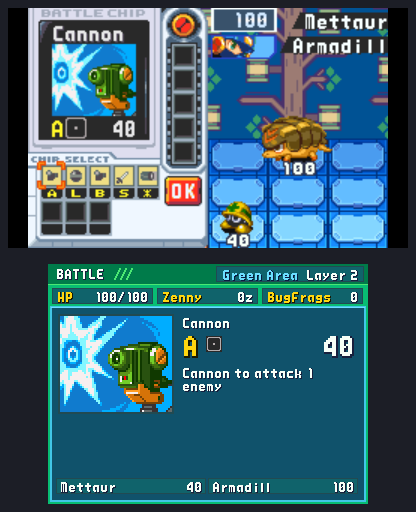
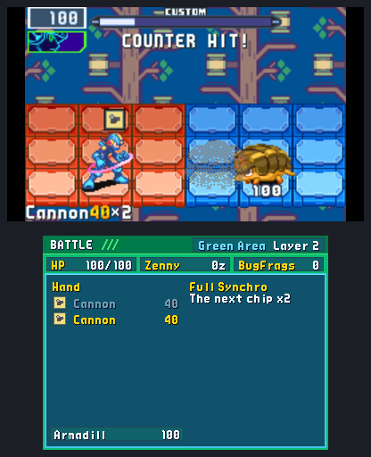
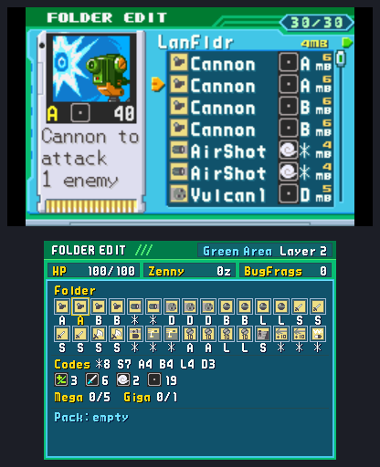
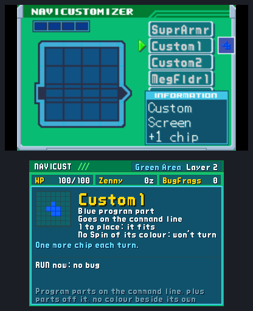
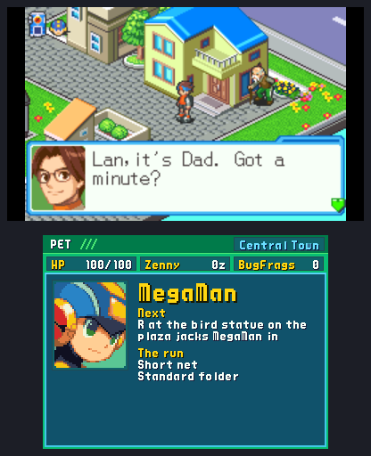
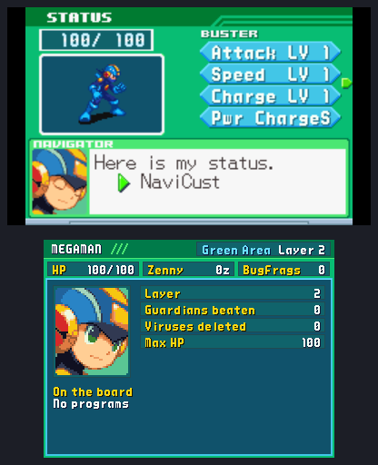
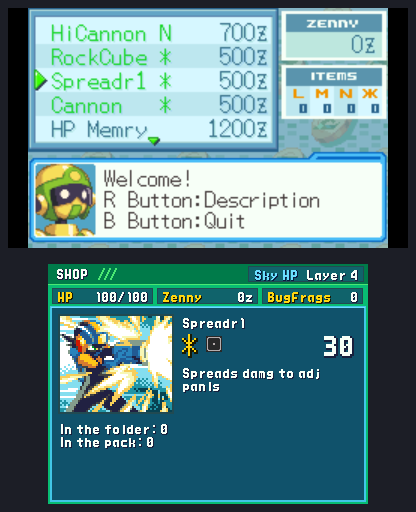
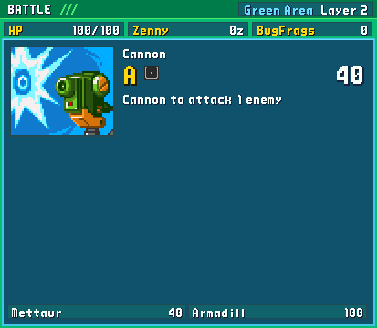

<h2 align="center">The second screen follows the game.</h2>

<b>The sixth beta:</b> on a New 3DS, and on Android handhelds with a second display like the AYN Thor, the lower screen is now a PET beside the game, as in the DS Battle Network games. It shows what the screen you are on needs: the map on the net, the chip under the cursor in battle, your whole folder in the editor, the program in the NaviCustomizer, the shop's wares, MegaMan's status, and his home in the town.

---

## 📟 A PET beside the game

The lower screen wears the PET's frame now, as Battle Network 5 DS's and Operate Shooting Star's did: the screen's name and where you are in its header, HP, Zenny and BugFrags under it. It knows which of BN6's screens you are on, read from the game as you play, and changes with it. On the net the layer's map stays open. ([#73](https://github.com/saschb2b/Mega-Man-Battle-Network-Cyberworld-Endless/issues/73))

## ⚔️ Battles

 

- **The Custom screen:** the chip under the cursor is a large card, as the DS games drew their chips: its picture twice as large, its code, element and power, and its text from the Library. The chips you picked are listed under it, and on OK, in the order they will fire.
- **CROSSSELECT:** the Cross under the cursor says what hits MegaMan twice as hard in it and what it gives. On the Beast Out emblem: the turns the EmotionCounter leaves, or that MegaMan is tired, and the Cybeast's Attack+30.
- **The fight:** the turn's chips in order with their power as the HUD writes it, the used ones dim and the next lit; your Cross and its weakness, Beast Out's turns left and Full Synchro; every enemy by name with its HP. Against a guardian MegaMan has met before: his element, and what MegaMan said of him at the arena.

([#74](https://github.com/saschb2b/Mega-Man-Battle-Network-Cyberworld-Endless/issues/74))

## 📁 The folder editor

Your whole folder at once, as BN5 DS's PET showed it: thirty chips as BN6's own icons, each framed by its rank (grey standard, blue Mega, red Giga, purple Dark) and marked where it is your Regular chip or a TagChip, the cursor's chip lit in gold. Under them, the folder's makeup: its chips by code (the Custom screen deals by code), by element, and its Megas and Gigas against the folder's limits. Then the Pack, scrolled to the cursor's chip on its side. The top screen keeps BN6's own card of the chip. ([#75](https://github.com/saschb2b/Mega-Man-Battle-Network-Cyberworld-Endless/issues/75))

## 🧩 The NaviCustomizer

The program under the cursor, in the list, on the board or held over it, is a card: its shape in BN6's own colour, what kind of part it is and where it goes, the copies left or where it stands, whether it fits the board's free cells as they are, whether L and R can turn it, and what it does in MegaMan's words. Under it, what RUN would bring with the board as it stands: no bug, or its cause, the same truth BN6 tells you a step later. ([#76](https://github.com/saschb2b/Mega-Man-Battle-Network-Cyberworld-Endless/issues/76))

## 🏠 The PET at home

  

- **In the town** the lower screen is no longer dark: MegaMan's face from the game, twice as large, where R jacks him in, and your run's setup.
- **The PET's menu** and its KeyItem, SubChip, E-Mail, Comm and Save screens show the same home, with the layer's next step: its guardian, or the exit pad.
- **MegaMan's status** adds the run's record (the layer, the guardians beaten, the viruses deleted, his max HP and what the NaviCust adds to it, the Cross you brought) and the programs on his board.
- **The Library** counts its classes against what a run can hold, and the chips this run added.
- **On the title** the PET rests with your profile's record (runs, best layer, guardians beaten, viruses deleted, short nets won) and says whether BN5's ROM was found beside BN6's.

([#79](https://github.com/saschb2b/Mega-Man-Battle-Network-Cyberworld-Endless/issues/79), [#77](https://github.com/saschb2b/Mega-Man-Battle-Network-Cyberworld-Endless/issues/77))

## 🛒 Shops and traders

At the Net Dealer and the NaviCust vendor, the entry under the cursor is a card (a chip's picture, code, element, power and text; a program's shape, kind and what it does; an item and, for the run's own, what it does) with what you already hold of it: the copies in your folder and Pack, a program's held and on the board. A Chip, Special or BugFrag Trader says what it takes and that its prize is a chip new to your Library, and how many chips your Pack holds. ([#78](https://github.com/saschb2b/Mega-Man-Battle-Network-Cyberworld-Endless/issues/78))

## ✨ Polish

- **BN6's own colours** on the NaviCust programs' blocks, measured from its preview of a program of each colour.
- **Larger second displays:** every panel lays out at an Android display's larger sizes too, from the AYN Thor's lower screen up.
- **Light on the New 3DS:** the lower screen is drawn only when what it shows changed, its frame kept as drawn while only the panel changes, and the map works out its way on only when its goal or its floor changed.

([#81](https://github.com/saschb2b/Mega-Man-Battle-Network-Cyberworld-Endless/issues/81))

## 🔧 Under the hood

For contributors, the code got tidier, with nothing you would see or hear changed:

- **`build.py lint` counts the code's smells** (files and functions past their size, wide includes, long parameter lists, deep nesting, repeated blocks, dialogue outside a words file), and none may join or grow.
- **Every line a character says lives in a words file,** so a voice pass reads them in one place: the director's 5095 lines are now fourteen files of one job each.
- **The longest files are split by what they do:** the layer generator, the tile picker, the map maker and the entry point.

## 📥 Get it

On [the download page](https://saschb2b.github.io/Mega-Man-Battle-Network-Cyberworld-Endless/download/) the best download for your device comes first, with every other system below.

| Where you play | Download | Then |
| --- | --- | --- |
| **In the browser** | nothing: [play here](https://saschb2b.github.io/Mega-Man-Battle-Network-Cyberworld-Endless/play/) | Choose your ROMs; runs and saves stay in your browser |
| **Windows** | `cyberworld-endless-windows-x64-setup.exe` or `cyberworld-endless-windows-x64.zip` | Run the installer, or unpack the zip and start `cyberworld-endless.exe`. If Windows says it protected your PC: **More info**, **Run anyway** |
| **macOS** | `cyberworld-endless-macos.dmg` | Drag the app into Applications. On the first start, **System Settings > Privacy & Security > Open Anyway** (it is not notarized) |
| **Android** | `cyberworld-endless.apk` | Open it on your phone and allow the install when Android asks; the app asks once for the folder your ROMs are in |
| **iPhone and iPad** | the AltStore source, `altstore-source.json`, or `cyberworld-endless.ipa` | Add the source in SideStore or AltStore Classic and install from it; choose your ROM folder in Files |
| **New 3DS** | `cyberworld-endless.cia` or `cyberworld-endless.3dsx` | Scan the download page's QR code with FBI (Remote Install, Scan QR Code), or install the CIA from the SD card with FBI. Put your ROM in `sdmc:/3ds/cyberworld-endless/rom/` |
| **Steam Deck** | `cyberworld-endless.flatpak` | Open it in Desktop Mode (Discover installs it), then add it to Steam with its art: one line in Konsole, [in the README](https://github.com/saschb2b/Mega-Man-Battle-Network-Cyberworld-Endless#on-a-steam-deck) |
| **Linux PC** | `cyberworld-endless-x86_64.AppImage`, `cyberworld-endless_amd64.deb`, `cyberworld-endless.flatpak` or `cyberworld-endless-linux-x86_64.tar.gz` | Make the AppImage executable and start it, or install the `.deb` or the Flatpak from your software centre, or unpack the archive anywhere |
| **Handhelds with PortMaster** (AmberELEC, ArkOS, Knulli, muOS, ROCKNIX) | `cyberworld-endless-portmaster.zip` | Unzip it, copy `cyberworld/` and `Cyberworld Endless.sh` into `ports/`, put your ROM in `ports/cyberworld/rom/`, refresh the game list |

**You need your own ROM:** *Mega Man Battle Network 6: Cybeast Gregar (USA)*, unmodified, and for the older net *Mega Man Battle Network 5: Team Colonel (USA)* beside it. The game finds them by their contents. Nothing in these downloads contains game data. Step-by-step guides are in the [README](https://github.com/saschb2b/Mega-Man-Battle-Network-Cyberworld-Endless#install).

## 🧪 A beta, honestly

- **A run saved by 0.9.0 carries on where it was:** layers and saves are made as before.
- **The second screen is the New 3DS's, and Android's where it has a second display;** every other system plays as before, the layer's map a SELECT away.
- **Not yet tried on real hardware:** the AYN Thor's lower screen, which was tested in the Android emulator with a display of its size. The New 3DS's was played on one.
- **The older 3DS and 2DS are too slow for it;** the New 3DS family plays it.
- Only Cybeast Gregar (USA) works for BN6, and Team Colonel (USA) for BN5.

Found a bug, a dead end or a fight that felt unfair? [Open an issue](https://github.com/saschb2b/Mega-Man-Battle-Network-Cyberworld-Endless/issues). Everything that changed since 0.9.0 is in the [changelog](../../CHANGELOG.md).

A fan project, not affiliated with or endorsed by Capcom. Mega Man and Battle Network are Capcom's; the game runs from the ROMs you own and none of it is distributed here. The start's chime is "UI Success Chime" by SoundShelfStudio, from Pixabay.
