

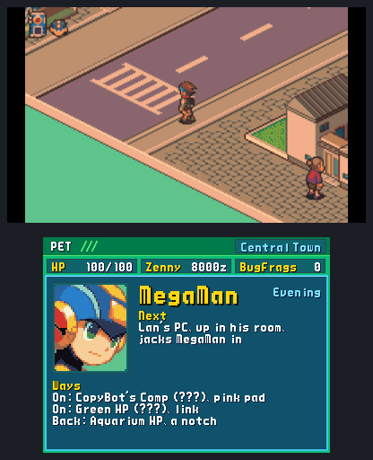

<h2 align="center">Home between dives.</h2>

<b>The seventh beta:</b> after every act MegaMan comes home. Lan's HP is the run's warp zone and Central Town the place between dives: its people post requests, AsterLand orders any chip you have ever held, and the town remembers your runs. Plus layers you can tell apart, the Cybeast and Bass as super bosses, a ROMs screen on every PC and phone, and a long list of fixes from your reports.

---

## 🏠 Home between dives

### Lan's HP is the warp zone

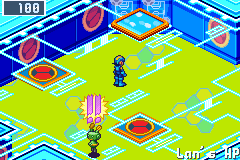

Every jack-in now arrives in Lan's HP, MegaMan's own homepage from BN6. Delete an act's guardian and his exit takes MegaMan home: the act's AREA CLEAR card, "Phew! We're home,Lan!", and the run saved. The pink pad leads into the act's own area, the link squares the other way, and into the Undernet once you have cleared the Secret Area. MegaMan arrives facing the way on, a portal tells you what MegaMan senses through it when you check it with A, and a link asks before it takes him anywhere, so a stray step never picks your act. R jacks out to Lan's room. ([#85](https://github.com/saschb2b/Mega-Man-Battle-Network-Cyberworld-Endless/issues/85), [#86](https://github.com/saschb2b/Mega-Man-Battle-Network-Cyberworld-Endless/issues/86), [#93](https://github.com/saschb2b/Mega-Man-Battle-Network-Cyberworld-Endless/issues/93), [#94](https://github.com/saschb2b/Mega-Man-Battle-Network-Cyberworld-Endless/issues/94), [#110](https://github.com/saschb2b/Mega-Man-Battle-Network-Cyberworld-Endless/issues/110))

### Going back, priced by the Net's clock

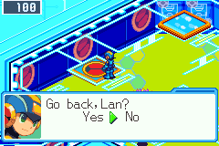

Two more portals lead back to the last two areas you have won, shown as BN6's link marker without its emblem: an orange pad with a red ring. A trip back is one layer at its act's tier, with a Net Dealer, a Recovery Mr.Prog, battles and Mystery Data, and its exit leads home again. But while MegaMan goes back, the Net keeps copying: every trip moves the Net's clock a notch, and every guardian after it has a tenth more HP. So a way back asks first, the cursor on No. ([#95](https://github.com/saschb2b/Mega-Man-Battle-Network-Cyberworld-Endless/issues/95))

### A Mr.Prog who knows what the town holds

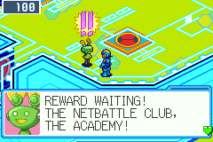

When the town holds something for your visit, a Mr.Prog waits in Lan's HP with a "!!" over him: a reward to collect, new requests and where they are posted, or the keys AsterLand stocked for the act ahead. Nothing waiting, no courier, and nobody talks you into the town. ([#108](https://github.com/saschb2b/Mega-Man-Battle-Network-Cyberworld-Endless/issues/108))

### Central Town, at the run's hour

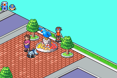 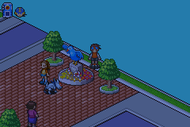

A run begins in Lan's room, and R at his PC jacks MegaMan in. Down the stairs is Central Town, the same every run, and the day goes on as the run does: morning as it begins, then afternoon, evening and night before the Nest. ([#90](https://github.com/saschb2b/Mega-Man-Battle-Network-Cyberworld-Endless/issues/90))

### AsterLand: the Order Service and SubChips

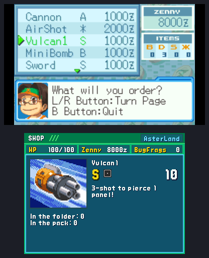

AsterLand's clerk runs BN6's own Order Service: any chip in your Library, in your folder's codes where it comes in them, at twice a Net Dealer's price, one order a visit. The SubChip seller beside him stocks the keys the act ahead needs (Unlockers, RushFood, a WWW-ID) and MiniEnrg, FullEnrg, SneakRun and Untrap. ([#89](https://github.com/saschb2b/Mega-Man-Battle-Network-Cyberworld-Endless/issues/89))

### Requests

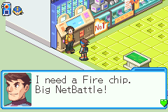

At each visit three people post a request for the act ahead: the NetBattler at AsterLand's board, the NetBattle club in Lan's class 6-1, and the man from the lab in town. Bring a chip of an element, win without a scratch, open every Mystery Data on a layer, or vow no Mr.Prog patch-ups until the guardian falls. Take one or none, as BN6's Request BBS has it; the one who asked pays at your next visit. ([#88](https://github.com/saschb2b/Mega-Man-Battle-Network-Cyberworld-Endless/issues/88))

### The Cyber Academy

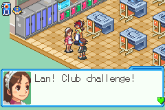

AsterLand and Lan's school open as places, BN6's own maps: the Academy's halls lead to class 6-1, where the NetBattle club meets on a day without class. ([#96](https://github.com/saschb2b/Mega-Man-Battle-Network-Cyberworld-Endless/issues/96))

### A town that remembers

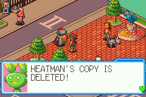

The plaza's Mr.Prog calls the Net's news: how your last run ended, and after each act the guardian you just deleted. Lan's friends and neighbours talk about this run and the runs before, and a different crowd is out at each visit. ([#87](https://github.com/saschb2b/Mega-Man-Battle-Network-Cyberworld-Endless/issues/87))

### The second screen at home

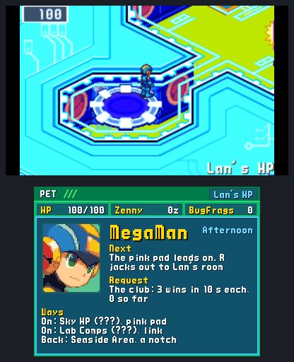

On a New 3DS or a second display, the PET's home panel names the hour, the request you hold and how far along it is, and each way in Lan's HP, on or back. ([#91](https://github.com/saschb2b/Mega-Man-Battle-Network-Cyberworld-Endless/issues/91))

## 🗺️ Layers to remember

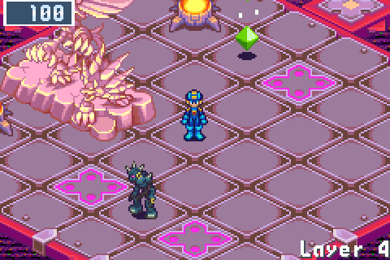

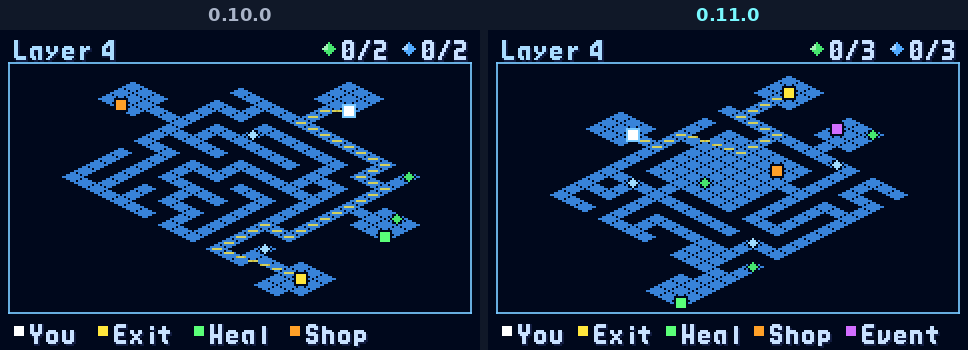

A player told us the net didn't feel random enough, and they were right: after a few layers, every layer felt the same. Each layer is now built around one room you remember it by, its signature, taken from its area's own landmarks in BN6: Central's crater, Seaside's great field, Sky's ring road around a pad, Green's grove under the giant cybertree, the Graveyard's great slab, the Undernet's statue court. It's the layer's biggest room, the way on runs through it, and an act's three layers are three different places. ([#98](https://github.com/saschb2b/Mega-Man-Battle-Network-Cyberworld-Endless/issues/98))

### Arriving from any side

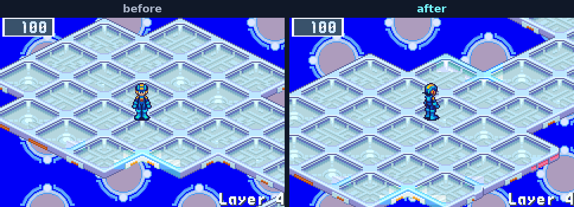

MegaMan always arrived at the top of the screen and walked down. BN6's own maps put their arrivals on every side, so the layers do now too, MegaMan facing into the layer, and an act's three layers arrive from three different sides. ([#106](https://github.com/saschb2b/Mega-Man-Battle-Network-Cyberworld-Endless/issues/106))

## 👑 Super bosses

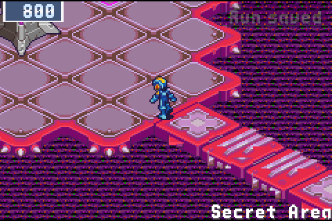 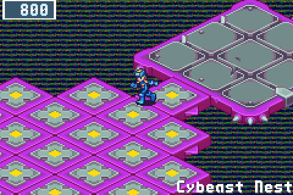

Bass and the Cybeast don't turn up at random. Each waits at its own place in the run, with an entrance bigger than any guardian's.

- **The Cybeast** waits at the bottom of the endless net: Gregar itself in BN6's own final battle, and Gregar SP on every Net after the first.
- **Bass** waits in the Secret Area once you have cleared it in any run, sealed in BN6's dormant stone: Bass, then Bass SP, then Bass BX.

The run hints at them long before you meet them, and never names them before you do. They pay BN6's GigaChips. ([#100](https://github.com/saschb2b/Mega-Man-Battle-Network-Cyberworld-Endless/issues/100))

### Beat the beast, then gain its power

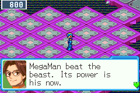 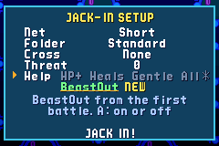

BeastOut now comes from beating the Cybeast, not from the Graveyard's guardian before it: his data only stirs the beast in MegaMan. Beat the Cybeast at the endless net's Nest and Dad's call unlocks the PET's CybeastButton, BeastOut yours for the rest of the run. ([#109](https://github.com/saschb2b/Mega-Man-Battle-Network-Cyberworld-Endless/issues/109))

Once that Nest has fallen in any run, the JACK-IN SETUP shows a fifth helper: BeastOut from the run's first battle, in the short net too. ([#99](https://github.com/saschb2b/Mega-Man-Battle-Network-Cyberworld-Endless/issues/99))

### Face to face with a guardian

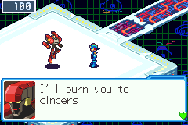

Before a guardian's talk, MegaMan steps up beside him and turns to face him, so the chat box covers neither of them, and the last words after the battle come in silence.

## 🎮 A ROMs screen, and saves that outlast a reinstall

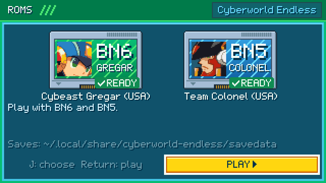 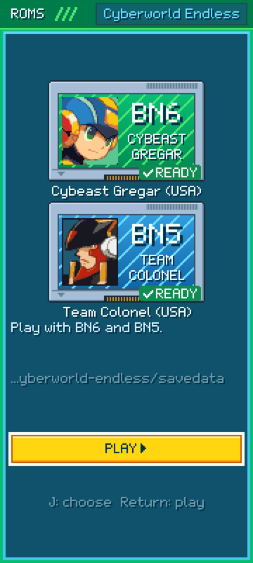

On a PC, a Mac, Android, an iPhone or an iPad, the game first opens on its ROMs screen: two cartridge slots, BN6 Cybeast Gregar and BN5 Team Colonel, each opening your system's own file chooser, or drop a file on the window. A wrong file is named with its reason ("BN6 Cybeast Falzar, not Gregar"). R on the title brings it back to add BN5 later. On phones and tablets the app keeps a copy of your saves in the ROM folder, so a reinstall can bring them back. ([#97](https://github.com/saschb2b/Mega-Man-Battle-Network-Cyberworld-Endless/issues/97))

## 📊 Anonymous statistics, asked for once

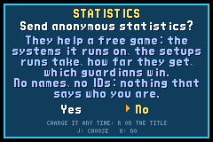

At its first start the game asks once whether it may send anonymous play statistics: the system it runs on, the setups runs take, how far they get and which guardians win. No names, no IDs, nothing that says who you are, and nothing before you say yes. The cursor starts on No, and the controls screen changes your answer any time. The README lists exactly what is sent. ([#104](https://github.com/saschb2b/Mega-Man-Battle-Network-Cyberworld-Endless/issues/104))

## 📟 The second screen, deeper in the PET

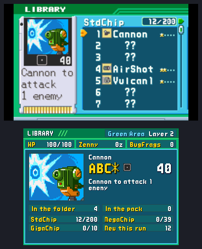 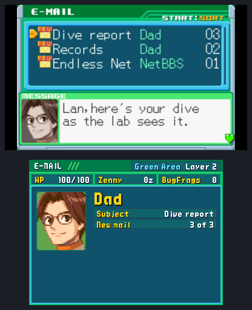 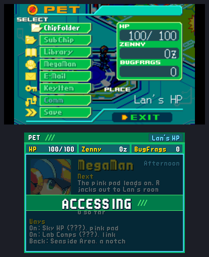

In the Library, the second screen shows the chip under the cursor as a card with the codes it comes in and your run's copies; in E-Mail, a mail's sender by face and name; and while the PET's menu is open, the PET's home dims under ACCESSING. ([#83](https://github.com/saschb2b/Mega-Man-Battle-Network-Cyberworld-Endless/issues/83))

## 🔧 Fixes from your reports

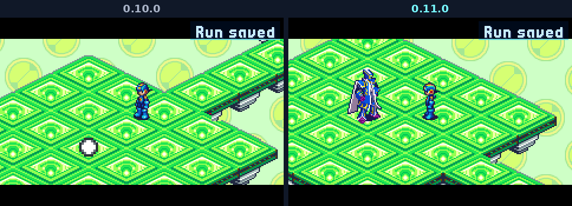

- **The PET's Library draws every chip again.** Chips from earlier runs came into each run's Library without the mark BN6 gives a chip it hands out, and wherever one stood on the page, BN6 drew no names and counted 0. Saved runs draw whole too.
- **JudgeMan stands as himself at his arena.** He stood as a white ball: his sprite is the only guardian's BN6 keeps compressed, and the layer never loaded it. The same fix brings back the link markers in Lan's HP.
- **CONTINUE no longer comes back with MegaMan stuck.** Saves now wait until BN6 lets MegaMan go, and a CONTINUE that finds him held lets go the way BN6's own routines do. ([#23](https://github.com/saschb2b/Mega-Man-Battle-Network-Cyberworld-Endless/issues/23))
- **ProtoMan can be hit after his cross.** A hit landing as his cross ended (a Silence pulse, or MegaMan where a stroke ends) left him untouchable for the rest of the battle. It is BN6's own bug, and closed now. Thanks @CybeastID for the report and the video. ([#55](https://github.com/saschb2b/Mega-Man-Battle-Network-Cyberworld-Endless/issues/55))
- **BN5's battles roll as the run does,** where every run's first battle in BN5's engine used to be the same one. ([#102](https://github.com/saschb2b/Mega-Man-Battle-Network-Cyberworld-Endless/issues/102))
- **A BN5 battle's BugFrags and green Mystery Data reach your run.**
- **On the 3DS, the PET says BN5's older net is for PC and phones,** instead of "BN5 not found". ([#107](https://github.com/saschb2b/Mega-Man-Battle-Network-Cyberworld-Endless/issues/107))
- **Townsfolk who walk stay drawn as they walk,** where Seaside's and Green Town's walker vanished the moment he set off.
- **MegaMan trusts you to know BN6:** no more lessons on the Pack, a battlefield's Mystery Data, the exit pad, the NaviCust's rules or the PET's menus. What the run adds is still said, a little clearer: why Rush needs a RushFood for each panel of a gap, and the older Net's chips that sit out named once a run, not twice.

## 🌐 On the site

After a download, the site now says thanks, with a link to buy me a coffee, the repository to star and follow, and the issues for bugs and ideas. ([#103](https://github.com/saschb2b/Mega-Man-Battle-Network-Cyberworld-Endless/issues/103))

## 📥 Get it

On [the download page](https://saschb2b.github.io/Mega-Man-Battle-Network-Cyberworld-Endless/download/) the best download for your device comes first, with every other system below.

| Where you play | Download | Then |
| --- | --- | --- |
| **In the browser** | nothing: [play here](https://saschb2b.github.io/Mega-Man-Battle-Network-Cyberworld-Endless/play/) | Choose your ROMs; runs and saves stay in your browser |
| **Windows** | `cyberworld-endless-windows-x64-setup.exe` or `cyberworld-endless-windows-x64.zip` | Run the installer, or unpack the zip and start `cyberworld-endless.exe`. If Windows says it protected your PC: **More info**, **Run anyway** |
| **macOS** | `cyberworld-endless-macos.dmg` | Drag the app into Applications. On the first start, **System Settings > Privacy & Security > Open Anyway** (it is not notarized) |
| **Android** | `cyberworld-endless.apk` | Open it on your phone and allow the install when Android asks; on the ROMs screen, choose the folder your ROMs are in |
| **iPhone and iPad** | the AltStore source, `altstore-source.json`, or `cyberworld-endless.ipa` | Add the source in SideStore or AltStore Classic and install from it; on the ROMs screen, choose your ROM folder in Files |
| **New 3DS** | `cyberworld-endless.cia` or `cyberworld-endless.3dsx` | Scan the download page's QR code with FBI (Remote Install, Scan QR Code), or install the CIA from the SD card with FBI. Put your ROM in `sdmc:/3ds/cyberworld-endless/rom/` |
| **Steam Deck** | `cyberworld-endless.flatpak` | Open it in Desktop Mode (Discover installs it), then add it to Steam with its art: one line in Konsole, [in the README](https://github.com/saschb2b/Mega-Man-Battle-Network-Cyberworld-Endless#on-a-steam-deck) |
| **Linux PC** | `cyberworld-endless-x86_64.AppImage`, `cyberworld-endless_amd64.deb`, `cyberworld-endless.flatpak` or `cyberworld-endless-linux-x86_64.tar.gz` | Make the AppImage executable and start it, or install the `.deb` or the Flatpak from your software centre, or unpack the archive anywhere |
| **Handhelds with PortMaster** (AmberELEC, ArkOS, Knulli, muOS, ROCKNIX) | `cyberworld-endless-portmaster.zip` | Unzip it, copy `cyberworld/` and `Cyberworld Endless.sh` into `ports/`, put your ROM in `ports/cyberworld/rom/`, refresh the game list |

**You need your own ROM:** *Mega Man Battle Network 6: Cybeast Gregar (USA)*, unmodified, and for the older net *Mega Man Battle Network 5: Team Colonel (USA)* beside it. The game finds them by their contents. Nothing in these downloads contains game data. Step-by-step guides are in the [README](https://github.com/saschb2b/Mega-Man-Battle-Network-Cyberworld-Endless#install).

## 🧪 A beta, honestly

- **A run saved by 0.10.0 continues,** but its current layer starts afresh, because layers are made differently now. Your profile, best depth and records stay.
- **Home comes after an act's guardian:** a run saved mid-act reaches Lan's HP when that act ends.
- **Not yet tried on real hardware:** the ROMs screen's pickers on a Mac, an iPhone and an iPad. CI builds both and starts them to the ROMs screen; Android's was tested in its emulator.
- **The older 3DS and 2DS are too slow for it;** the New 3DS family plays it, BN6 alone.
- Only Cybeast Gregar (USA) works for BN6, and Team Colonel (USA) for BN5.

Found a bug, a dead end or a fight that felt unfair? [Open an issue](https://github.com/saschb2b/Mega-Man-Battle-Network-Cyberworld-Endless/issues). Everything that changed since 0.10.0 is in the [changelog](../../CHANGELOG.md).

A fan project, not affiliated with or endorsed by Capcom. Mega Man and Battle Network are Capcom's; the game runs from the ROMs you own and none of it is distributed here. The start's chime is "UI Success Chime" by SoundShelfStudio, from Pixabay.
