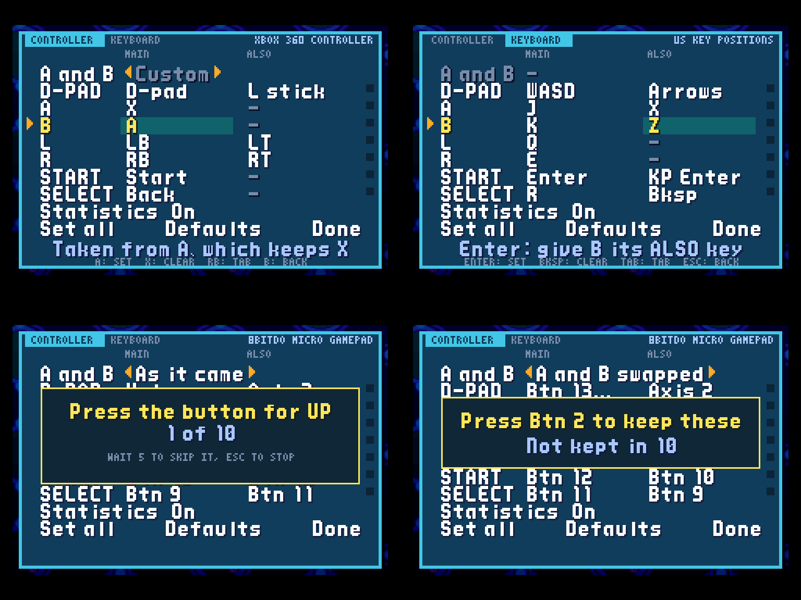

<h2 align="center">Any controller, any map.</h2>

<b>A hotfix for 0.11:</b> controllers SDL does not know, the 8BitDo Micro among them, are read as they are, and the controls screen is laid out as the big games lay theirs.

---

## 🎮 Controllers

- **Pads without a layout work** ([#112](https://github.com/saschb2b/Mega-Man-Battle-Network-Cyberworld-Endless/issues/112)). An 8BitDo Micro, and any pad SDL has no layout for, went unread: the game opened only the pads SDL calls controllers. They are read as they are now, their hat and first stick moving MegaMan and their buttons named by number on the controls screen. In the browser, a pad the browser does not know had its D-pad nowhere; it is read the same way, Chrome's hat on one axis too. Thanks to Mattwj for the report.

## 🕹️ The controls screen

SELECT on the title opens it, everywhere but on the 3DS.

- **A tab per device,** CONTROLLER and KEYBOARD, with L and R between them.
- **A row per GBA button, with a MAIN and an ALSO slot,** and a dot that lights when you press it, so you can try a map before you keep it.
- **The D-pad is one row.** Its four directions are asked in turn, each a button, a stick, a hat or a key, so a pad in keyboard mode can set its directions too.
- **A clash is swapped and said:** "Swapped: A now on B". X clears a slot.
- **Set all** asks for every button in turn, for a pad laid out its own way.
- **Nothing is kept unasked:** Done, and Back after a change, ask you to press the new A first.

## 🌐 The project page

[The project page](https://saschb2b.github.io/Mega-Man-Battle-Network-Cyberworld-Endless/) draws one run as one picture below the trailer, from Lan's room to the Nest. The README is one page of pictures too, and everything it held is in the new [player's guide](https://github.com/saschb2b/Mega-Man-Battle-Network-Cyberworld-Endless/blob/main/docs/GUIDE.md).

## 📥 Get it

On [the download page](https://saschb2b.github.io/Mega-Man-Battle-Network-Cyberworld-Endless/download/) the best download for your device comes first, with every other system below.

| Where you play | Download | Then |
| --- | --- | --- |
| **In the browser** | nothing: [play here](https://saschb2b.github.io/Mega-Man-Battle-Network-Cyberworld-Endless/play/) | Choose your ROMs; runs and saves stay in your browser |
| **Windows** | `cyberworld-endless-windows-x64-setup.exe` or `cyberworld-endless-windows-x64.zip` | Run the installer, or unpack the zip and start `cyberworld-endless.exe`. If Windows says it protected your PC: **More info**, **Run anyway** |
| **macOS** | `cyberworld-endless-macos.dmg` | Drag the app into Applications. On the first start, **System Settings > Privacy & Security > Open Anyway** (it is not notarized) |
| **Android** | `cyberworld-endless.apk` | Open it on your phone and allow the install when Android asks; on the ROMs screen, choose the folder your ROMs are in |
| **iPhone and iPad** | the AltStore source, `altstore-source.json`, or `cyberworld-endless.ipa` | Add the source in SideStore or AltStore Classic and install from it; on the ROMs screen, choose your ROM folder in Files |
| **New 3DS** | `cyberworld-endless.cia` or `cyberworld-endless.3dsx` | Scan the download page's QR code with FBI (Remote Install, Scan QR Code), or install the CIA from the SD card with FBI. Put your ROM in `sdmc:/3ds/cyberworld-endless/rom/` |
| **Steam Deck** | `cyberworld-endless.flatpak` | Open it in Desktop Mode (Discover installs it), then add it to Steam with its art: one line in Konsole, [in the guide](https://github.com/saschb2b/Mega-Man-Battle-Network-Cyberworld-Endless/blob/main/docs/GUIDE.md#on-a-steam-deck) |
| **Linux PC** | `cyberworld-endless-x86_64.AppImage`, `cyberworld-endless_amd64.deb`, `cyberworld-endless.flatpak` or `cyberworld-endless-linux-x86_64.tar.gz` | Make the AppImage executable and start it, or install the `.deb` or the Flatpak from your software centre, or unpack the archive anywhere |
| **Handhelds with PortMaster** (AmberELEC, ArkOS, Knulli, muOS, ROCKNIX) | `cyberworld-endless-portmaster.zip` | Unzip it, copy `cyberworld/` and `Cyberworld Endless.sh` into `ports/`, put your ROM in `ports/cyberworld/rom/`, refresh the game list |

**You need your own ROM:** *Mega Man Battle Network 6: Cybeast Gregar (USA)*, unmodified, and for the older net *Mega Man Battle Network 5: Team Colonel (USA)* beside it. The game finds them by their contents. Nothing in these downloads contains game data. Step-by-step guides are in the [player's guide](https://github.com/saschb2b/Mega-Man-Battle-Network-Cyberworld-Endless/blob/main/docs/GUIDE.md#install).

Found a bug, a dead end or a fight that felt unfair? [Open an issue](https://github.com/saschb2b/Mega-Man-Battle-Network-Cyberworld-Endless/issues). Everything that changed is in the [changelog](../../CHANGELOG.md).

A fan project, not affiliated with or endorsed by Capcom. Mega Man and Battle Network are Capcom's; the game runs from the ROMs you own and none of it is distributed here. The start's chime is "UI Success Chime" by SoundShelfStudio, from Pixabay.
