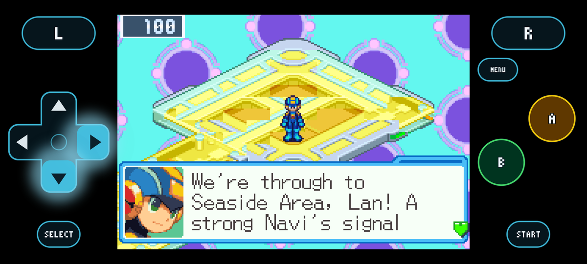
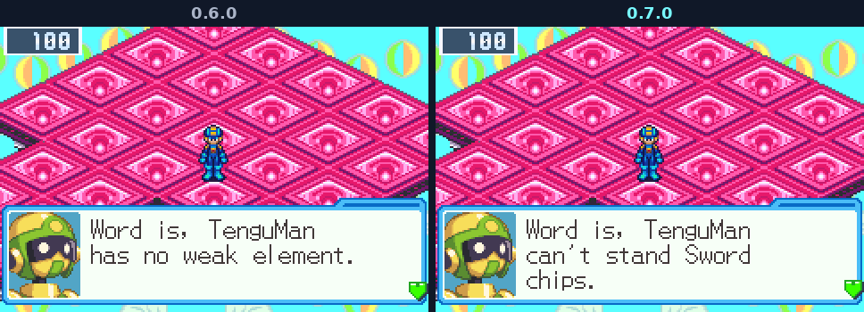

<h2 align="center">Cyberworld Endless comes to iPhone and iPad, and the game runs lighter everywhere.</h2>

<b>The third beta:</b> an iOS app through AltStore and SideStore, a GBA core that does a quarter to a third less work a frame, Net Dealers that know every guardian's weakness, and a download page you can read at a glance.

---

## 📱 iPhone and iPad

Apple's App Store takes no app that runs on a ROM, so this one comes through [AltStore Classic](https://altstore.io) or [SideStore](https://sidestore.io), which install apps with your own Apple ID and keep them up to date.

1. Set up AltStore Classic or SideStore on your iPhone or iPad. Each needs a computer once; on iOS 16 and newer, turn on Developer Mode too.
2. On [the download page](https://saschb2b.github.io/Mega-Man-Battle-Network-Cyberworld-Endless/download/#ios), tap **Add to AltStore** or **add to SideStore**. Or in the app: **Sources**, **+**, and `https://github.com/saschb2b/Mega-Man-Battle-Network-Cyberworld-Endless/releases/latest/download/altstore-source.json`.
3. Install **Cyberworld Endless** from the source. With a free Apple ID, AltStore renews it every seven days, and offers each new version.
4. Start it and tap **CHOOSE ROM**: pick your ROM in Files. Or put it in Files, **On My iPhone › Cyberworld**, where the app keeps your saves too.

- **Touch controls round the picture,** as on Android: under it when you hold the phone upright, beside it when it lies on its side, clear of the notch and the home indicator, with a tick under your thumb. A controller works too (MFi, Xbox, PlayStation).
- **Sent to the background, it keeps your run** where MegaMan stands.
- iOS 14 and newer. `cyberworld-endless.ipa` is the app alone, for another installer.

## ⚡ A lighter core

- **The GBA core rests while BN6 waits for the screen.** The game waits for each frame by reading the screen's status over and over, half of the core's work on a layer and more in battle; the core now sleeps through that wait until the frame begins. A frame of the game takes about 30% less time on a PC, a quarter less on a Retroid Nova (3.98 ms became 3.09), and on a New 3DS, where it took nearly all of each frame, 15.9 ms became 11.0.
- **The New 3DS shows its frames evenly:** each waits for the screen's refresh, where frames had come early or late several times a second.
- **The engine hears from the game as things happen,** through breakpoints in the game's code, where it used to look over the game's memory every frame and patch code into it. How the game plays is unchanged.

## 🗡️ Every guardian's weakness

- **The Net Dealers name the second wheel too** ([#39](https://github.com/saschb2b/Mega-Man-Battle-Network-Cyberworld-Endless/issues/39)). BN6 has two: Fire, Aqua, Elec and Wood, and Sword, Wind, Cursor and Breaker, as its Cross lessons teach. SlashMan can't stand Breaker chips, EraseMan Wind, TenguMan Sword, GroundMan and DustMan Cursor, where the dealers had said they had no weak element. A Sword's 80 takes 160 of TenguMan's HP.
- **His pick is of that kind:** a sword for TenguMan, who hovers right in front between his dashes; otherwise never a chip that only strikes beside MegaMan.
- **The way on names these guardians' elements too,** such as TenguMan (Wind), and ElementMan is said to change his element as he fights. Every other guardian was right, checked against the ROM and the wiki.

## 📥 A clearer download page

- **It leads with the best pick for your device,** its file, its size and its steps open, and lists every system below in four groups: computer, phone and tablet, handheld and console, no install. Each has one main file, its other formats named for who they are for, and how to install it.
- **Handhelds with PortMaster, all of them:** the port is for every firmware that runs PortMaster (AmberELEC, ArkOS, Knulli, muOS, ROCKNIX and others), and its file is now `cyberworld-endless-portmaster.zip`.

## 🛠️ Fixes

- **Pressing L no longer changes the battles to come.** In acts 3 and 5, MegaMan's status drew one of the run's random numbers each time it opened.
- **The viruses' weakness a Net Dealer names counts each virus as it is fought:** Swordy2 is Fire, so a few areas' word changed.

[#39](https://github.com/saschb2b/Mega-Man-Battle-Network-Cyberworld-Endless/issues/39) was found by [@CybeastID](https://github.com/CybeastID). Thank you!

## 📥 Get it

On [the download page](https://saschb2b.github.io/Mega-Man-Battle-Network-Cyberworld-Endless/download/) the best download for your device comes first, with every other system below.

| Where you play | Download | Then |
| --- | --- | --- |
| **In the browser** | nothing: [play here](https://saschb2b.github.io/Mega-Man-Battle-Network-Cyberworld-Endless/play/) | Choose your ROM; runs and saves stay in your browser |
| **Windows** | `cyberworld-endless-windows-x64-setup.exe` or `cyberworld-endless-windows-x64.zip` | Run the installer, or unpack the zip and start `cyberworld-endless.exe`. If Windows says it protected your PC: **More info**, **Run anyway** |
| **macOS** | `cyberworld-endless-macos.dmg` | Drag the app into Applications. On the first start, **System Settings > Privacy & Security > Open Anyway** (it is not notarized) |
| **Android** | `cyberworld-endless.apk` | Open it on your phone and allow the install when Android asks; the app asks once for your ROM |
| **iPhone and iPad** | the AltStore source, `altstore-source.json`, or `cyberworld-endless.ipa` | Add the source in AltStore or SideStore and install from it; choose your ROM in Files |
| **New 3DS** | `cyberworld-endless.cia` or `cyberworld-endless.3dsx` | Scan the download page's QR code with FBI (Remote Install, Scan QR Code), or install the CIA from the SD card with FBI. Put your ROM in `sdmc:/3ds/cyberworld-endless/rom/` |
| **Steam Deck** | `cyberworld-endless.flatpak` | Open it in Desktop Mode (Discover installs it), then add it to Steam with its art: one line in Konsole, [in the README](https://github.com/saschb2b/Mega-Man-Battle-Network-Cyberworld-Endless#on-a-steam-deck) |
| **Linux PC** | `cyberworld-endless-x86_64.AppImage`, `cyberworld-endless_amd64.deb`, `cyberworld-endless.flatpak` or `cyberworld-endless-linux-x86_64.tar.gz` | Make the AppImage executable and start it, or install the `.deb` or the Flatpak from your software centre, or unpack the archive anywhere |
| **Handhelds with PortMaster** (AmberELEC, ArkOS, Knulli, muOS, ROCKNIX) | `cyberworld-endless-portmaster.zip` | Unzip it, copy `cyberworld/` and `Cyberworld Endless.sh` into `ports/`, put your ROM in `ports/cyberworld/rom/`, refresh the game list |

**You need your own ROM:** *Mega Man Battle Network 6: Cybeast Gregar (USA)*, unmodified. On first start the game finds it by its contents (in Downloads, EmuDeck's or RetroDECK's folders, where 3DS players keep GBA games, in Files on an iPhone, or wherever you point it). Nothing in these downloads contains game data. Step-by-step guides are in the [README](https://github.com/saschb2b/Mega-Man-Battle-Network-Cyberworld-Endless#install).

## 🧪 A beta, honestly

- **The iPhone and iPad app was built and started in Apple's iOS Simulator, not yet on a real device.** If you try it, tell us how it runs: an [issue](https://github.com/saschb2b/Mega-Man-Battle-Network-Cyberworld-Endless/issues) with your model and iOS version helps a lot.
- **A run saved by 0.6.0 continues,** but its current layer starts afresh, because the Net Dealers' stock is made differently now. Your profile, best depth and records stay.
- **BN5's areas aren't on the 3DS, Android, iPhone or in the browser yet.**
- **The older 3DS and 2DS are too slow for it;** the New 3DS family plays it.
- Only Cybeast Gregar (USA) works for BN6, and Team Colonel (USA) for BN5.

Found a bug, a dead end or a fight that felt unfair? [Open an issue](https://github.com/saschb2b/Mega-Man-Battle-Network-Cyberworld-Endless/issues). Everything that changed since 0.6.0 is in the [changelog](../../CHANGELOG.md).

A fan project, not affiliated with or endorsed by Capcom. Mega Man and Battle Network are Capcom's; the game runs from the ROM you own and none of it is distributed here.
