

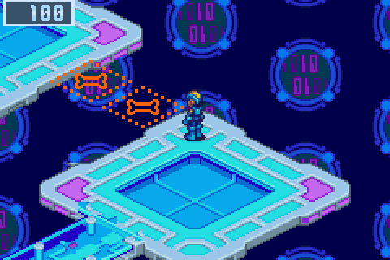

<h2 align="center">The net's layers are worth exploring now.</h2>

<b>The fourth beta:</b> BN6's own set pieces on every layer, each a lock off the way with a good Mystery Data behind it, RegUps and TagChips, compression codes that stay, a map that counts what you've found, and a net that whispers its rumors.

---

## 🧩 BN6's set pieces, placed as Capcom placed them

Every set piece is BN6's own, drawn from the game, and stands off the way as Capcom's do: a lock, its key somewhere in the run, and something good behind it. Press L on a layer and MegaMan names the ones he senses; the first time you meet each kind, he says what it is and what opens it.

### 🦴 Rush's bone gaps

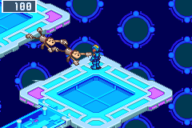 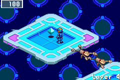

A gap of one to three panels with bones over it, a walkway aimed across it at a pad with a blue Mystery Data. Hold as many RushFood as the gap has panels and press A at the edge: Rush eats one and lies in the gap for good, BN6's own cutscene and all. The Net Dealer sells RushFood where the act holds a gap, and says where it is. ([#14](https://github.com/saschb2b/Mega-Man-Battle-Network-Cyberworld-Endless/issues/14))

### 💎 Teleport pads

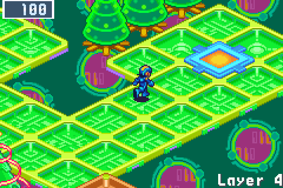

In Green, Sky and Central, a pair of BN6's gem pads: step on one and MegaMan beams to the other, the camera following. A quick way back from a long detour, or the only way out to an island in the void with a blue Mystery Data on it, a few steps down from where you land. ([#44](https://github.com/saschb2b/Mega-Man-Battle-Network-Cyberworld-Endless/issues/44))

### 🌳 Link Navi obstacles

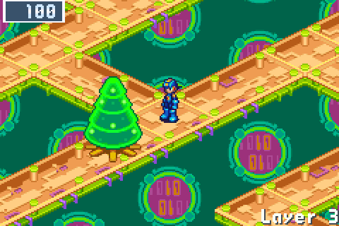

Cybertrees, flames, cyclones, clouds and geysers of cyberwater stand in the mouths of pockets, each area its own kind. Your run's Cross clears them as Gregar's Link Navis do: carrying HeatMan's Cross, press A at a cybertree and HeatMan burns it away. Without the right Cross, MegaMan says whose would, a hint for your next run's setup. ([#42](https://github.com/saschb2b/Mega-Man-Battle-Network-Cyberworld-Endless/issues/42))

### 🔒 Security cubes

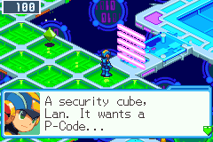 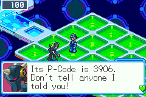

Comps, homepages and Central lock a pocket with BN6's security cube. It wants a P-Code, and one navi on the layer knows it: ask around. Seaside's cubes take a toll instead. ([#45](https://github.com/saschb2b/Mega-Man-Battle-Network-Cyberworld-Endless/issues/45))

### ➡️ Arrow lanes

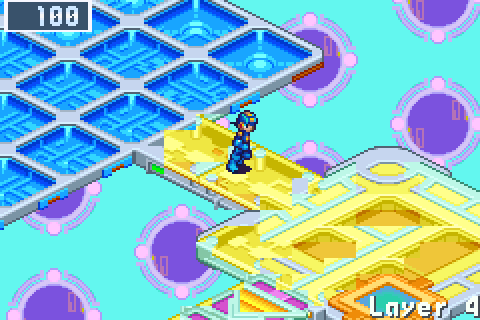

BN6's arrow panels carry MegaMan from the end of a long detour back toward the way: walk the long way in, ride out. Each area draws its own, and walked from the far end they push you back. ([#43](https://github.com/saschb2b/Mega-Man-Battle-Network-Cyberworld-Endless/issues/43))

### 👻 Invisible paths

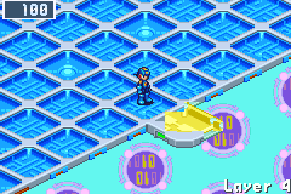 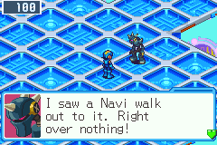

From the second act on, Seaside, Sky, the Undernet and the Nest can hide floor drawn as void, as BN6 does: straight out from a walkway's tip to a lonely pad with a good Mystery Data. A navi nearby saw someone walk out there over nothing. ([#46](https://github.com/saschb2b/Mega-Man-Battle-Network-Cyberworld-Endless/issues/46))

### 💀 The Undernet's doors

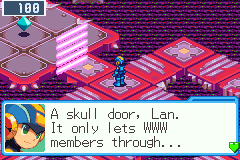 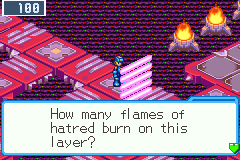

Skull doors let only WWW members through: the act's Net Dealer sells the WWW-ID, and one opens every skull door of the run. Number doors ask how many flames of hatred burn on the layer, so count the braziers before you answer; a wrong answer seals the door. ([#47](https://github.com/saschb2b/Mega-Man-Battle-Network-Cyberworld-Endless/issues/47))

### 🟣 Purple Mystery Data

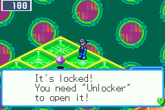 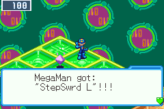

Locked, as in BN6: an Unlocker opens it, and it holds a chip of the rarest kinds that no dealer sells. The Net Dealer stocks an Unlocker for each one ahead in the act, and tells you where it lies. Blue data now lie where the detours end and green ones lie loose, so a long walk is worth it. ([#41](https://github.com/saschb2b/Mega-Man-Battle-Network-Cyberworld-Endless/issues/41), [#40](https://github.com/saschb2b/Mega-Man-Battle-Network-Cyberworld-Endless/issues/40))

### 🗣️ MegaMan senses them

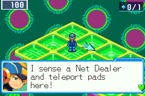

On a layer's first L, MegaMan names its set pieces along with its services, and explains each kind the first time you meet it. ([#48](https://github.com/saschb2b/Mega-Man-Battle-Network-Cyberworld-Endless/issues/48))

## 🗺️ Finding your way

### 💠 Mystery Data counters

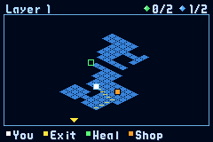 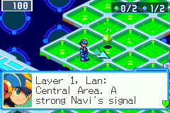

Hold SELECT and the map's header counts the Mystery Data you know of, by colour: taken, of those you've seen or MegaMan senses behind a set piece. Press L and the same counters show in the corner for a few seconds. They count what you've found, never where the rest is, so a secret stays a secret until you find it, and you know what's left before you step on the one-way exit.

### 📍 Services where they stand

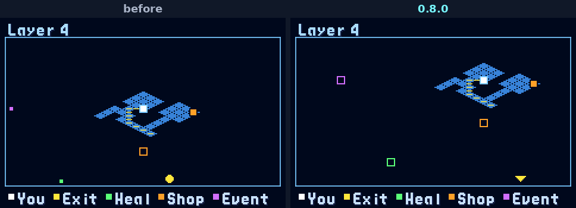

On a partly explored layer, the shops, heals and others MegaMan senses sat as pips on the map's frame, read as standing at its edge. The map now zooms out to show them as rings where they stand, and anything still past the frame is an arrowhead pointing its way.

### 🛣️ Wider ways

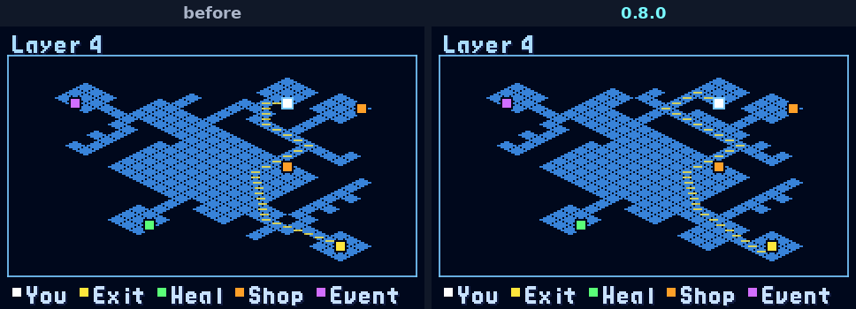

MegaMan walks as BN6 walks him, so a one-panel walkway is entered only from its exact lane. The way across a layer now crosses no more of them than its area's own BN6 maps do: wider ways in Seaside, Green, the Secret Area, the Nest and Mr. Weather's comp. Central keeps its glass bridges.

- **The arrow's way turns less.** Across a lattice of walkways, the shortest way turned at nearly every crossing, a stop and a new direction each. Of the shortest ways it now takes the one that turns least.
- **No long detour leads to nothing.** A branch five panels or more off the way that held nothing now ends in a Mystery Data.

## 🧠 Your Navi and your run

### 📈 RegUps and TagChips

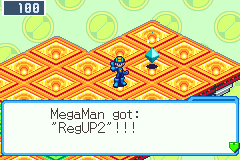 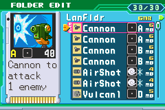

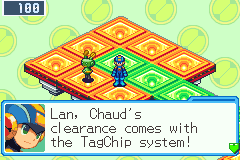 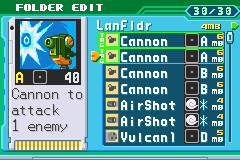

Every layer before a guardian hides a RegUp, behind a lock or at the end of a detour, so your Reg memory grows from 4 MB to about 20 by the third act. Set a Regular Chip in the folder's EDIT with SELECT and it starts every battle in your hand. Win your first duel against ProtoMan, and Chaud's clearance brings the TagChip system for good: two tagged chips, under 60 MB together, come to your hand as a pair. ([#51](https://github.com/saschb2b/Mega-Man-Battle-Network-Cyberworld-Endless/issues/51))

### 🧩 Compression codes, kept

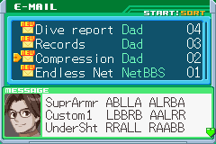

A NaviCust compression code you enter once is kept for every run after. Dad's Compression mail lists each code you've entered, and when a program won't fit, MegaMan names its code if compressing it would make room. You still press the ten buttons yourself. And MegaMan now reads a compressed program's shape as the PET has it, so a second compressed Custom1 fits where he said it wouldn't. ([#50](https://github.com/saschb2b/Mega-Man-Battle-Network-Cyberworld-Endless/issues/50), [#54](https://github.com/saschb2b/Mega-Man-Battle-Network-Cyberworld-Endless/issues/54))

### 🔀 Two guardians at every split

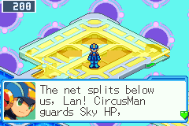 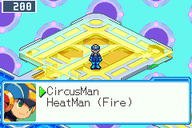

After a guardian, the second way on could name the same guardian as the act ahead. It now always offers another.

### 🎁 What a run you gave up opened is yours

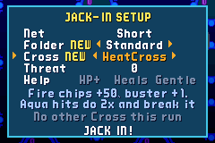

A guardian deleted opens his Cross start, and the Blade folder, at once. But a first run given up through NEW GAME jacked straight in without the setup screen, so there was nothing to choose them from. The setup now opens whenever something is open, and marks what's new.

## 💬 A net that talks

### 🤫 The net's rumors

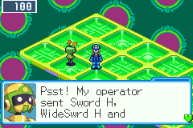 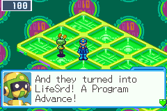

One navi on each layer whispers, the way a schoolyard did: a Program Advance from BN6's own table, picked for chips in your folder, or a hint at a secret you haven't found yet, never its answer. Every rumor is true.

### 🏫 Schoolyard talk in town

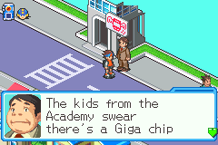 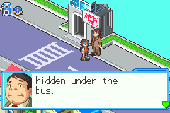

The townsfolk trade the old rumors: a Giga chip under Central Town's bus (the bus stop knows better), the Academy's hunt for Program Advances, Higsby's back room, Mr. Famous's boasts, Dr. Wily blamed for everything, and the NaviCust's secret buttons.

### 📰 The Endless Net BBS

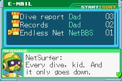 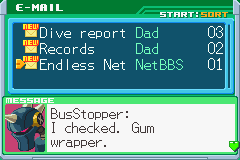

A new mail in the PET collects the netizens' threads about the net, each post in its poster's face: tips, sightings and the odd myth, with more posts the deeper you've been.

## 🛠️ Fixes

- **CircusMan's tent marker stays on the field** ([#52](https://github.com/saschb2b/Mega-Man-Battle-Network-Cyberworld-Endless/issues/52)). The yellow mark on the panel his tent is about to drop on was drawn over the Custom screen's chips. It now hides while the window covers the field, and shows again when SELECT hides it.
- **The battle controls, said right** ([discussion #53](https://github.com/saschb2b/Mega-Man-Battle-Network-Cyberworld-Endless/discussions/53)). Running from a battle is L on the Custom screen, not L and R. R on the Custom screen describes the chip or Cross under the cursor, and SELECT hides the window to show the field.
- **TagChips, said right.** A tagged pair has to come to less than 60 MB, whatever your Reg memory, as BN6's own mail says.
- **Every navi on a layer shows.** BN6 runs at most sixteen NPCs on a map; one layer in sixteen held more, and its last bystanders, or now and then an official gate or ProtoMan's duel, never appeared.
- **Set pieces play fair:** obstacles and cubes can't be walked round, a navi no longer stands where your A at a set piece reaches him instead, the navi who tells a cube's P-Code always finds a place to stand, and the Net Dealer's keys always make his list.
- **No more pads that look like warps and aren't.** In BN6 every pad with a gem, ring or cube is a warp, and now they're only drawn where they warp.
- **iPhone and iPad: SideStore first.** In the EU, AltStore PAL installs only apps Apple has notarized and refused the source. The download page, the README and the FAQ now lead with SideStore and name AltStore Classic beside it.

[#50](https://github.com/saschb2b/Mega-Man-Battle-Network-Cyberworld-Endless/issues/50), [#51](https://github.com/saschb2b/Mega-Man-Battle-Network-Cyberworld-Endless/issues/51), [#52](https://github.com/saschb2b/Mega-Man-Battle-Network-Cyberworld-Endless/issues/52), [#54](https://github.com/saschb2b/Mega-Man-Battle-Network-Cyberworld-Endless/issues/54) and [discussion #53](https://github.com/saschb2b/Mega-Man-Battle-Network-Cyberworld-Endless/discussions/53) came from [@CybeastID](https://github.com/CybeastID). Thank you!

## 📥 Get it

On [the download page](https://saschb2b.github.io/Mega-Man-Battle-Network-Cyberworld-Endless/download/) the best download for your device comes first, with every other system below.

| Where you play | Download | Then |
| --- | --- | --- |
| **In the browser** | nothing: [play here](https://saschb2b.github.io/Mega-Man-Battle-Network-Cyberworld-Endless/play/) | Choose your ROM; runs and saves stay in your browser |
| **Windows** | `cyberworld-endless-windows-x64-setup.exe` or `cyberworld-endless-windows-x64.zip` | Run the installer, or unpack the zip and start `cyberworld-endless.exe`. If Windows says it protected your PC: **More info**, **Run anyway** |
| **macOS** | `cyberworld-endless-macos.dmg` | Drag the app into Applications. On the first start, **System Settings > Privacy & Security > Open Anyway** (it is not notarized) |
| **Android** | `cyberworld-endless.apk` | Open it on your phone and allow the install when Android asks; the app asks once for your ROM |
| **iPhone and iPad** | the AltStore source, `altstore-source.json`, or `cyberworld-endless.ipa` | Add the source in SideStore or AltStore Classic and install from it; choose your ROM in Files |
| **New 3DS** | `cyberworld-endless.cia` or `cyberworld-endless.3dsx` | Scan the download page's QR code with FBI (Remote Install, Scan QR Code), or install the CIA from the SD card with FBI. Put your ROM in `sdmc:/3ds/cyberworld-endless/rom/` |
| **Steam Deck** | `cyberworld-endless.flatpak` | Open it in Desktop Mode (Discover installs it), then add it to Steam with its art: one line in Konsole, [in the README](https://github.com/saschb2b/Mega-Man-Battle-Network-Cyberworld-Endless#on-a-steam-deck) |
| **Linux PC** | `cyberworld-endless-x86_64.AppImage`, `cyberworld-endless_amd64.deb`, `cyberworld-endless.flatpak` or `cyberworld-endless-linux-x86_64.tar.gz` | Make the AppImage executable and start it, or install the `.deb` or the Flatpak from your software centre, or unpack the archive anywhere |
| **Handhelds with PortMaster** (AmberELEC, ArkOS, Knulli, muOS, ROCKNIX) | `cyberworld-endless-portmaster.zip` | Unzip it, copy `cyberworld/` and `Cyberworld Endless.sh` into `ports/`, put your ROM in `ports/cyberworld/rom/`, refresh the game list |

**You need your own ROM:** *Mega Man Battle Network 6: Cybeast Gregar (USA)*, unmodified. On first start the game finds it by its contents (in Downloads, EmuDeck's or RetroDECK's folders, where 3DS players keep GBA games, in Files on an iPhone, or wherever you point it). Nothing in these downloads contains game data. Step-by-step guides are in the [README](https://github.com/saschb2b/Mega-Man-Battle-Network-Cyberworld-Endless#install).

## 🧪 A beta, honestly

- **A run saved by 0.7.0 continues,** but its current layer starts afresh, because layers are made differently now. Your profile, best depth and records stay.
- **BN5's areas aren't on the 3DS, Android, iPhone or in the browser yet.**
- **The older 3DS and 2DS are too slow for it;** the New 3DS family plays it.
- Only Cybeast Gregar (USA) works for BN6, and Team Colonel (USA) for BN5.

Found a bug, a dead end or a fight that felt unfair? [Open an issue](https://github.com/saschb2b/Mega-Man-Battle-Network-Cyberworld-Endless/issues). Everything that changed since 0.7.0 is in the [changelog](../../CHANGELOG.md).

A fan project, not affiliated with or endorsed by Capcom. Mega Man and Battle Network are Capcom's; the game runs from the ROM you own and none of it is distributed here.
