

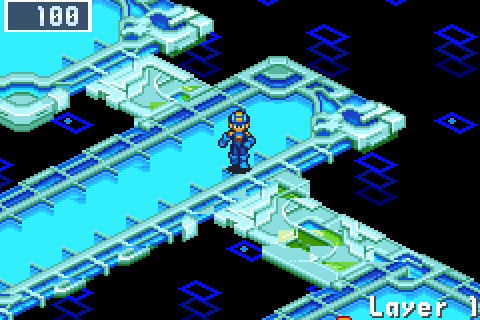

<h2 align="center">Battle Network 5 joins the net.</h2>

<b>The fifth beta:</b> with Team Colonel's ROM beside BN6's, BN5's areas now fight BN5's own battles in BN5's own engine, guarded by BN5's own Navis, with Souls and DarkChips, on phones and in the browser too. Plus every line rewritten in BN6's own voice, healing that matters, a controls screen, Joy-Cons on Android, the AYN Thor's second screen and a new start.

---

## 💬 Everyone talks like BN6 now

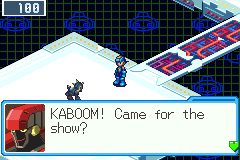 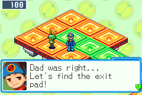

A player told us our dialogue felt like "reading a summary of a regular sentence". They were right. So we read BN6's whole script, character by character, and rewrote every line in the game to match it: about six words a box, a feeling before a fact, and every character in their own voice.

- **MegaMan** worries, cheers and teases, and calls Lan by name. **Lan** answers back and decides.
- **Mr.Prog** speaks in capitals: "ONE PATCH A LAYER! MAKE IT COUNT!"
- **The guardians** each have their habit: ChargeMan's "Choo,choo!! Departure time!", SpoutMan's "D-Don't come closer,drip!", DiveMan's "Awooga!", EraseMan's "Hyahaha!".
- **The bystanders** gossip: "I heard a Cybeast roar down below... My operator says it's just data. R-Right?"
- **Battle data** is a warning a box: "His fire tower gives no yellow warning!" / "It turns into our row. Sidestep it late!"

The guide we wrote from BN6's script, [docs/VOICE.md](../../docs/VOICE.md), is now the measure for every new line.

## 🌐 The older net

Put *Mega Man Battle Network 5: Team Colonel (USA)* beside your BN6 ROM and the older net joins your runs: some of BN6's areas come dressed as BN5's, in BN5's own tiles, music, backgrounds and bystanders. Until now they only looked the part. In 0.9.0 they play it.

### ⚔️ BN5's battles, in BN5's engine

A random battle in one of BN5's areas is BN5's own: its viruses and their AI, its Custom screen, its results, run by BN5's engine on a second core while BN6 waits. MegaMan goes in with your run's HP, folder and NaviCust buster and comes back with what the battle left him and its reward, a chip as BN6's chip of the same name. A loss there ends the run. The switch breaks BN6's map into blocks and flashes into BN5's battle, which opens in half a second, and BN5's battles keep to the act's difficulty, from the act's band like BN6's.

- **Your whole folder fights.** A chip BN5 never had sits out, and MegaMan names those chips before the first battle ("Our CrakShot and Atk+10 didn't exist back then either"). A chip whose code BN5's chip never had goes in with one it has, and Lan notices once: "Huh? In there our Thunder S was Thunder *!"
- **About half of BN5's rewards come in your folder's codes,** and the chip BN5's results screen shows is the chip you get. ([#63](https://github.com/saschb2b/Mega-Man-Battle-Network-Cyberworld-Endless/issues/63))
- **The old net had no Crosses.** MegaMan says so before your first BN5 battle; your NaviCust's Attack, Speed and Charge do come along. ([#62](https://github.com/saschb2b/Mega-Man-Battle-Network-Cyberworld-Endless/issues/62))
- **Know where you are:** an act's card reads "older net battles", L names the area "where battles run the older net's way", and the split says "the older net's Oran Area". ([#65](https://github.com/saschb2b/Mega-Man-Battle-Network-Cyberworld-Endless/issues/65))

### 🗺️ Six of BN5's areas

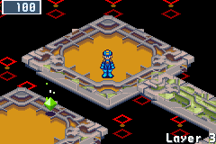 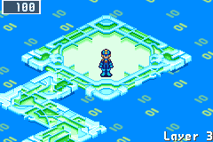

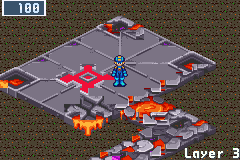 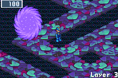

Oran Area, SciLab and BN5's Undernet join ACDC Area, End Area and Nebula Area, each in about half the runs that reach its place. They move as they do in BN5 (ACDC Area's blinking diamonds, Nebula Area's static, their lights pulsing in BN5's colours), and bring BN5's own pieces: its orange Navi among the bystanders, its green Security Cube, its wall of dark flames, and the purple dark holes past Nebula Area's edges. BN5's battles stand in front of their own area's background.

### 🛡️ BN5's Navis guard its areas

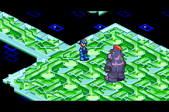 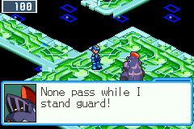

In half the runs, BN5's own Navi waits in an act's arena where BN5 sets him roaming: KnightMan in ACDC Area, ShadowMan in Oran Area, TomahawkMan in SciLab, NumberMan or ToadMan in End Area, Colonel in its Undernet. He stands in his own sprite, speaks with his own face, and fights his battle in BN5's engine, at three quarters of a BN6 guardian's HP. His Guardian Data gives what BN6's do, with a chip of his kind in place of a Navi chip BN6 lacks: KnightMan's JustcOne, ToadMan's BblWrap. ([#69](https://github.com/saschb2b/Mega-Man-Battle-Network-Cyberworld-Endless/issues/69))

### 💠 Souls

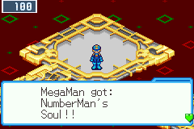 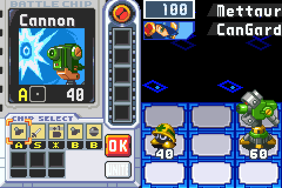

Beat a BN5 guardian and his Soul is yours for the run's BN5 battles: pick a chip of his Soul's kind and UNITE on the Custom screen, and MegaMan fights in his Soul for a few turns, once a battle and only while calm, as BN5 has it. His kind of DarkChip unites too, as Chaos Unison. Souls last to the end of the run, through CONTINUE, and never carry over. ([#69](https://github.com/saschb2b/Mega-Man-Battle-Network-Cyberworld-Endless/issues/69))

### 🔥 DarkChips, at a price

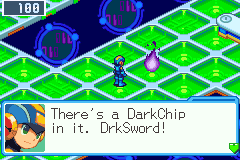 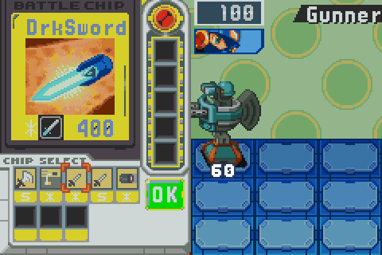

On the middle layer of an act, a purple flame of darkness holds a DarkChip, and MegaMan names its price before you take it: **every battle its dark power runs in costs 20 max HP, one HPMemory, for the rest of the run.** In BN5's areas it comes by BN5's own rule, offered when MegaMan worries (hurt to a quarter of his HP, or hit again and again), and if he falls after using one, BN5's darkness may get him back up a while.

And BN6 has its own: as [@CybeastID](https://github.com/CybeastID) pointed out, BN6 still holds four of BN5's DarkChips with their working code, DrkSword, DarkThnd, DrkRecov and DarkInvs. In acts whose battles are BN6's, the flame holds one of those, **on every build, the 3DS and runs without BN5's ROM included.** Each use burns a BugFrag for its dark power and bugs MegaMan for the battle, as a NaviCust bug does; with no BugFrag it is only its base chip, and the Custom screen says so. Three DarkChips at most in a folder, as BN6's own rule has it. A DarkChip is one chip in both nets. ([#64](https://github.com/saschb2b/Mega-Man-Battle-Network-Cyberworld-Endless/issues/64), [#70](https://github.com/saschb2b/Mega-Man-Battle-Network-Cyberworld-Endless/issues/70))

### ⏳ No more freeze

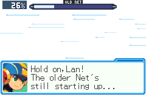

BN5's first start froze the game for about five seconds on a handheld as your first BN5 area was made. It now runs in the background from the moment the game starts, on a thread of its own (in the browser, in each frame's spare time), and once done it is kept. In the rare case a BN5 battle comes before it has finished, the battle waits behind this screen, in BN6's own look, instead of a frozen picture.

### 📱 On phones and in the browser too

- **Android and iPhone take BN5:** the first start asks for the folder your ROMs are in and takes BN6 and BN5 from it, each checked; BN5 put there later comes in by itself. Android's **Choose the files instead** takes both at once, and the app icon's **ROMs** shortcut adds BN5 later. ([#66](https://github.com/saschb2b/Mega-Man-Battle-Network-Cyberworld-Endless/issues/66))
- **The browser takes BN5 too,** with **Add BN5 Team Colonel** on the player's page; a wrong file is refused with its reason. ([#68](https://github.com/saschb2b/Mega-Man-Battle-Network-Cyberworld-Endless/issues/68))

## ❤️ Healing that matters

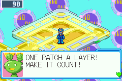 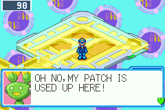

A Recovery Mr. Prog healed MegaMan fully as often as you asked, so every detour's damage came back free and the Net Dealer's MiniEnrg had little use. He now patches MegaMan **once per layer, half his max HP, and to full before the arena**; asked again, he points you to the dealer. A won guardian still heals fully, and the Heals helper keeps unlimited full heals. From [@ChaseThe3nd](https://github.com/ChaseThe3nd)'s balance proposal. ([#71](https://github.com/saschb2b/Mega-Man-Battle-Network-Cyberworld-Endless/issues/71))

## 🎮 Your controller, your buttons

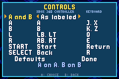

**SELECT on the title screen** opens the new controls screen (and **CONTROLLER** in the touch menu on a phone with a controller). Pick a preset for A and B (as labeled; **B on X**, left of A as on the GBA, for Xbox-style pads; or swapped), or press the button you want for each of A, B, L, R, START and SELECT. Done asks you to press your new A within ten seconds, or the old controls stay, so no choice can lock you out. Keys can be set the same way. The developer's sprite gallery moved to L+SELECT. ([#37](https://github.com/saschb2b/Mega-Man-Battle-Network-Cyberworld-Endless/issues/37))

- **Joy-Cons work on Android.** A left Joy-Con's Minus asked to quit, its L did nothing and the wrong stick moved MegaMan. Both halves now map as one controller in a pair, or a small sideways one alone. Tested with emulated Joy-Cons; reports from real ones are welcome. ([#37](https://github.com/saschb2b/Mega-Man-Battle-Network-Cyberworld-Endless/issues/37))
- **A controller plugged in or paired while the game runs is picked up,** and one taken away is let go.

## ✨ A new start

 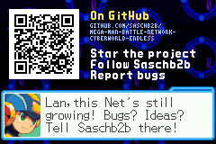

Each start now opens with the developer's boot screen, Saschb2b coming up in two pieces on a chime, then MegaMan asking for your bugs and ideas on the project's GitHub page, with a QR code for your phone's camera. About six seconds; any button skips each part. Every report helps, and so does a ⭐.

## 📱 Handhelds and phones

### 🗺️ The AYN Thor's second screen

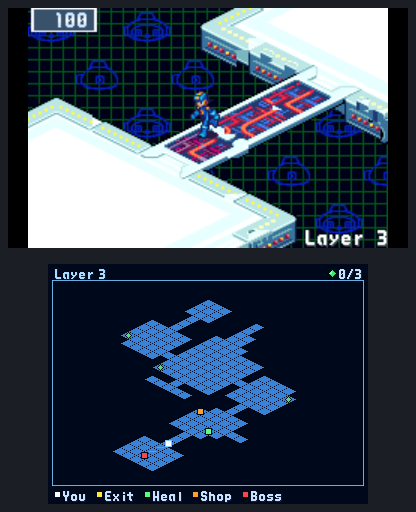

On the AYN Thor, and any Android handheld with a second display, the lower screen now keeps the layer's map open, as the 3DS's bottom screen does: the floor you've seen, the way on, what MegaMan senses. Controls and focus stay with the game. Tried in the Android emulator with a display the size of the Thor's lower screen, not yet on a real Thor: reports are welcome.

### 📲 Phones held upright fill the width

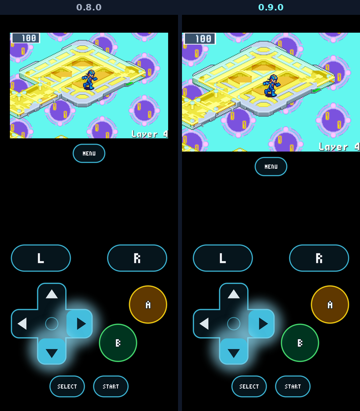

Held upright, the picture was drawn at the largest whole scale, with black bars at its sides. It now fills the screen's width with sharp scaling, in the Android and iPhone apps and in the browser, the touch controls under it keeping their size. (`screen = whole` in `settings.ini` keeps whole pixels.)

- **A turned Android phone keeps the game whole.** Turning it could leave the game small in a corner, or black until the app was closed.
- **The game opens again on Android after a quit with Back,** where it closed at once.
- **The browser plays its sound sooner** when played with a keyboard.
- **The 3DS's bottom screen goes black when a run ends.**

## 🧭 Your run

### ✳️ A fourth helper: All \*

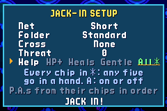

For players who love the battles but not the hunt for codes: with **All \*** in the JACK-IN SETUP's Help row, every chip of the run comes in \*, the wildcard, and every Program Advance forms from its chips in order. Off by default, chosen per run, and named in the run's summary. ([#18](https://github.com/saschb2b/Mega-Man-Battle-Network-Cyberworld-Endless/issues/18))

### 🧭 The map marks locks and Mystery Data

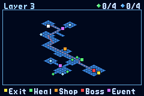

Security cubes, Link Navi obstacles and the Undernet's doors show on the map as violet marks, and every Mystery Data you've seen and not taken as a small crystal of its colour. Holding an Unlocker marks every purple Mystery Data on the layer. L says which way a lock is when he senses data behind it.

### 💾 The run saves at the arena's door

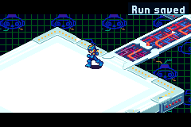

As MegaMan steps into a guardian's arena, the run is saved: quit during the fight and CONTINUE starts again from the door with the HP you walked in with, not from the layer's start. No random battle starts on the way in, either, and CONTINUE now says where the run goes on from.

### 🧍 Every guardian in his own shape

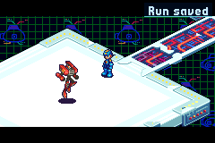 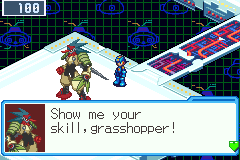

Seven of the seventeen guardians stood on the net as a HeelNavi. BlastMan and ElementMan now stand in Gregar's own sprites, and Falzar's Navis (SpoutMan, TomahawkMan, TenguMan, GroundMan, DustMan) in their battle sprites, each warping in and facing MegaMan; Falzar's Navis speak with a portrait made from their battle data.

### 🧩 The program pick says what fits

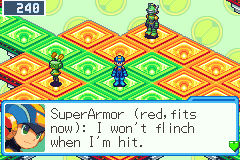

After a guardian, each program in the NaviCust's draft says "fits now" or "fits if we move one", from your board as it stands.

### And more

- **L's first words on a layer are the guardian, the heal and the way on;** the rest comes at a second L, and L starts over after a CONTINUE.
- **The arrow:** along walkways and bands it points the way they run; at a walkway's mouth it shows the way that walks MegaMan in; once the Guardian Data is taken it leads straight to the exit pad.
- **Purple Mystery Data holds a rare chip or better,** a Mega chip, or deep in a run a Giga chip.
- **A guardian's battle pays zenny,** not a second copy of his chip that no folder can hold.
- **A Server that holds a Navi says so** before you choose, and holds the same battle after a CONTINUE.
- **Where a new chip went:** the first time a chip comes, MegaMan says it went to the Pack and how to swap it in.
- **Green's ladders cross in one line,** and services and navis keep off the way more often.
- **Bystanders never wall off the way** to an exit or an arena.
- **A layer's Mystery Data hold the same after a CONTINUE,** and so do ProtoMan's record and the flame of darkness.
- **SlipRunr says what it does,** **CircusMan's battle data says how fast his tent falls,** **ProtoMan's no-hit duel forgives the fight's first second,** and **a NaviCust bug is named the moment you RUN.**
- **Rumors tell the folder's Program Advances only,** in the folder's own codes. ([#56](https://github.com/saschb2b/Mega-Man-Battle-Network-Cyberworld-Endless/issues/56))
- **Every "Are you sure?" in a shop starts on Yes,** as in BN6, and so does "Leaving already?".

## 🛠️ Fixes

- **A layer no longer turns black as MegaMan arrives.** A layer with a Link Navi obstacle could leave the next one on the same map pointing at stale data: a black screen at the exit pad that only a restart cleared.
- **Central Area and Green Area draw their own tiles after a BN5 run,** where a later run in the same sitting drew a jumble of BN5's.
- **A run continued without BN5's ROM starts its layer again** in BN6's area, where the screen stayed black.
- **BN5's areas bring their battles as BN6's do:** after the first, each came at the walk's top chance, eight battles in under two layers.
- **A win in BN5's battles counts its viruses** in the run summary, and **L warns of BN6's viruses only where BN6's battles are.**
- **The run summary no longer shows "BN5 found" over its first lines.**
- **A program's reminder stays said across CONTINUE,** and the Undernet's copy and the Undernet itself are told apart.
- **Words fixed:** "Pack" with its capital, one name for the net (the Endless Net), + chips said right, a guardian's Cross data no longer sounds like an offer, the Net Dealer says how many RushFood Rush needs.

## 🔬 For modders and researchers

What the project has mapped of BN6 and BN5 is now open for anyone to use: [docs/symbols](../../docs/symbols) holds symbol files that mGBA's and no$gba's debuggers load, and the same symbols as JSON and CSV, every address the engine uses with what it is and how it was verified. `tools/bn6f_match.py` locates 98.1% of the [bn6f](https://github.com/dism-exe/bn6f) disassembly's functions in Cybeast Gregar, and 31.7% in BN5 Team Colonel, which has no public disassembly. [docs/SYMBOLS.md](../../docs/SYMBOLS.md) says how.

Thank you to [@CybeastID](https://github.com/CybeastID) for BN6's DarkChips and the B-on-X layout, [@ChaseThe3nd](https://github.com/ChaseThe3nd) for the healing proposal, and [@Pink5G](https://github.com/Pink5G) for the Joy-Con report!

## 📥 Get it

On [the download page](https://saschb2b.github.io/Mega-Man-Battle-Network-Cyberworld-Endless/download/) the best download for your device comes first, with every other system below.

| Where you play | Download | Then |
| --- | --- | --- |
| **In the browser** | nothing: [play here](https://saschb2b.github.io/Mega-Man-Battle-Network-Cyberworld-Endless/play/) | Choose your ROMs; runs and saves stay in your browser |
| **Windows** | `cyberworld-endless-windows-x64-setup.exe` or `cyberworld-endless-windows-x64.zip` | Run the installer, or unpack the zip and start `cyberworld-endless.exe`. If Windows says it protected your PC: **More info**, **Run anyway** |
| **macOS** | `cyberworld-endless-macos.dmg` | Drag the app into Applications. On the first start, **System Settings > Privacy & Security > Open Anyway** (it is not notarized) |
| **Android** | `cyberworld-endless.apk` | Open it on your phone and allow the install when Android asks; the app asks once for the folder your ROMs are in |
| **iPhone and iPad** | the AltStore source, `altstore-source.json`, or `cyberworld-endless.ipa` | Add the source in SideStore or AltStore Classic and install from it; choose your ROM folder in Files |
| **New 3DS** | `cyberworld-endless.cia` or `cyberworld-endless.3dsx` | Scan the download page's QR code with FBI (Remote Install, Scan QR Code), or install the CIA from the SD card with FBI. Put your ROM in `sdmc:/3ds/cyberworld-endless/rom/` |
| **Steam Deck** | `cyberworld-endless.flatpak` | Open it in Desktop Mode (Discover installs it), then add it to Steam with its art: one line in Konsole, [in the README](https://github.com/saschb2b/Mega-Man-Battle-Network-Cyberworld-Endless#on-a-steam-deck) |
| **Linux PC** | `cyberworld-endless-x86_64.AppImage`, `cyberworld-endless_amd64.deb`, `cyberworld-endless.flatpak` or `cyberworld-endless-linux-x86_64.tar.gz` | Make the AppImage executable and start it, or install the `.deb` or the Flatpak from your software centre, or unpack the archive anywhere |
| **Handhelds with PortMaster** (AmberELEC, ArkOS, Knulli, muOS, ROCKNIX) | `cyberworld-endless-portmaster.zip` | Unzip it, copy `cyberworld/` and `Cyberworld Endless.sh` into `ports/`, put your ROM in `ports/cyberworld/rom/`, refresh the game list |

**You need your own ROM:** *Mega Man Battle Network 6: Cybeast Gregar (USA)*, unmodified, and for the older net *Mega Man Battle Network 5: Team Colonel (USA)* beside it. The game finds them by their contents. Nothing in these downloads contains game data. Step-by-step guides are in the [README](https://github.com/saschb2b/Mega-Man-Battle-Network-Cyberworld-Endless#install).

## 🧪 A beta, honestly

- **A run saved by 0.8.0 continues,** but its current layer starts afresh, because layers are made differently now. Your profile, best depth and records stay.
- **The 3DS keeps BN6's battles:** BN5's areas and battles aren't on it, but BN6's own DarkChips are.
- **Not yet tried on real hardware:** the AYN Thor's second screen and real Joy-Cons on Android were tested in the Android emulator only.
- **The older 3DS and 2DS are too slow for it;** the New 3DS family plays it.
- Only Cybeast Gregar (USA) works for BN6, and Team Colonel (USA) for BN5.

Found a bug, a dead end or a fight that felt unfair? [Open an issue](https://github.com/saschb2b/Mega-Man-Battle-Network-Cyberworld-Endless/issues). Everything that changed since 0.8.0 is in the [changelog](../../CHANGELOG.md).

A fan project, not affiliated with or endorsed by Capcom. Mega Man and Battle Network are Capcom's; the game runs from the ROMs you own and none of it is distributed here. The start's chime is "UI Success Chime" by SoundShelfStudio, from Pixabay.
